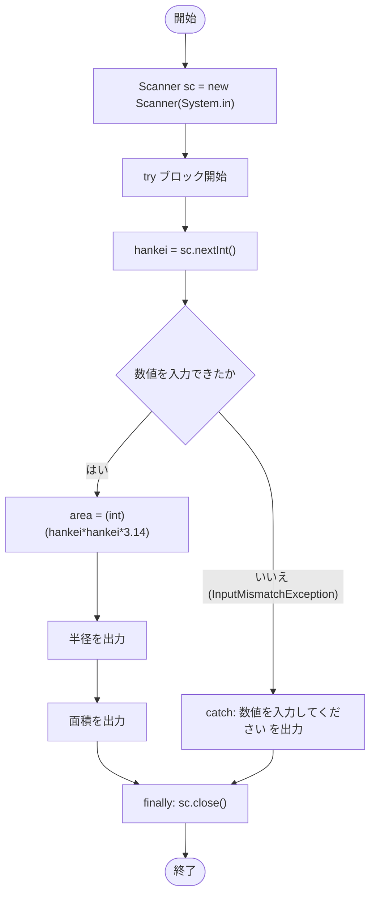

# CalcCircle — フローチャートとトレース表

- 対象ファイル: `src/CalcCircle.java`
- パッケージ: デフォルト
- テーマ: Scanner による標準入力と try-catch-finally による例外処理を学ぶサンプル。半径を入力させて円の面積を計算する。

## ソースの要点

```java
Scanner sc = new Scanner(System.in);
try {
    int hankei = sc.nextInt(); // キーボード入力した値をxに代入.
    int area = (int) (hankei * hankei * 3.14);
    System.out.println("円の半径を入力してください＞" + hankei);
    System.out.println("円の面積は" + area + "です");
} catch (InputMismatchException ex) {
    System.out.println("数値を入力してください");
} finally {
    sc.close();
}
```

## フローチャート



## トレース表

入力例: `3`

| ステップ | 文 | hankei | area | 入力 | 出力 |
|---|---|---|---|---|---|
| 1 | `Scanner sc = new Scanner(System.in)` | - | - | - | - |
| 2 | `int hankei = sc.nextInt()` | 3 | - | 3 | - |
| 3 | `int area = (int)(hankei*hankei*3.14)` | 3 | 28 | - | - |
| 4 | `System.out.println("円の半径を入力してください＞" + hankei)` | 3 | 28 | - | 円の半径を入力してください＞3 |
| 5 | `System.out.println("円の面積は" + area + "です")` | 3 | 28 | - | 円の面積は28です |
| 6 | `sc.close()` (finally) | 3 | 28 | - | - |

## 実行結果（標準出力）

入力例: `3`

```
円の半径を入力してください＞3
円の面積は28です
```

入力例: `abc`（数値以外）

```
数値を入力してください
```

## 学習ポイント

- `Scanner` を使ったキーボード入力（`nextInt()`）。
- `try-catch-finally` による例外処理。`InputMismatchException` を捕捉して数値以外の入力に対応。
- `(int)` キャストで `double` の計算結果を `int` に丸める。
