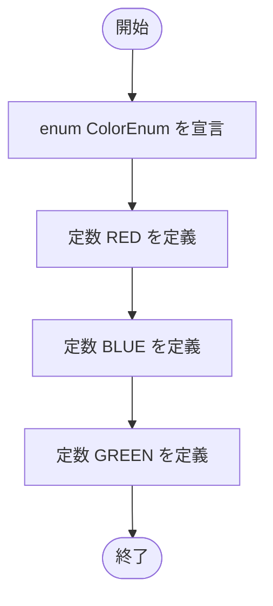

# ColorEnum — フローチャートとトレース表

- 対象ファイル: `src/ColorEnum.java`
- パッケージ: デフォルト
- テーマ: 単純な enum 定義のサンプル。色を表す 3 つの定数（RED, BLUE, GREEN）を列挙する。

## ソースの要点

```java
enum ColorEnum {
    RED, BLUE, GREEN
}
```

このファイルは `main` を持たず、enum 定義のみ。`SampleSwitchWithEnum` などから利用される。

## フローチャート



## トレース表

| ステップ | 文 | 定義された定数 |
|---|---|---|
| 1 | `enum ColorEnum { ... }` | - |
| 2 | `RED` | RED |
| 3 | `BLUE` | RED, BLUE |
| 4 | `GREEN` | RED, BLUE, GREEN |

## 実行結果（標準出力）

`main` メソッドを持たないため、このファイル単体での実行結果はない。
利用例（`SampleSwitchWithEnum.testColorEnum1()`）:

```
RED
```

## 学習ポイント

- `enum` は関連する複数の定数をひとつの型としてまとめる Java SE 1.5 以降の機能。
- `ColorEnum.RED` のように `型名.定数名` でアクセスする。
- `switch` 文の式に enum を渡すと、`case RED:` のように定数名のみで分岐できる。
