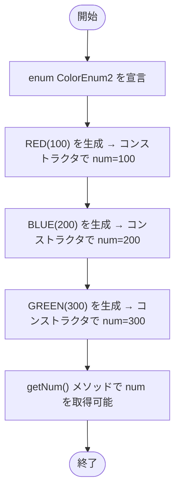

# ColorEnum2 — フローチャートとトレース表

- 対象ファイル: `src/ColorEnum2.java`
- パッケージ: デフォルト
- テーマ: 値（フィールド）を持つ enum のサンプル。各定数にコンストラクタで数値を割り当てる。

## ソースの要点

```java
public enum ColorEnum2 {
    RED(100), BLUE(200), GREEN(300);

    private int num;

    private ColorEnum2(int num) {
        this.num = num;
    }

    public int getNum() {
        return this.num;
    }
}
```

このファイルは `main` を持たず、enum 定義のみ。`SampleSwitchWithEnum.testColorEnum2()` から利用される。

## フローチャート



## トレース表

| ステップ | 文 | 生成された定数 | num の値 |
|---|---|---|---|
| 1 | `RED(100)` | RED | 100 |
| 2 | `BLUE(200)` | BLUE | 200 |
| 3 | `GREEN(300)` | GREEN | 300 |
| 4 | `ColorEnum2.BLUE.getNum()` | - | 200 を返す |

## 実行結果（標準出力）

`main` メソッドを持たないため、このファイル単体での実行結果はない。
利用例（`SampleSwitchWithEnum.testColorEnum2()`）:

```
BLUE: num 200
```

## 学習ポイント

- enum はフィールド・コンストラクタ・メソッドを持つことができる。
- enum のコンストラクタは `private`（暗黙的に private）で、`RED(100)` のように定数定義時に呼び出される。
- `getNum()` のようなインスタンスメソッドで保持した値を取得できる。
