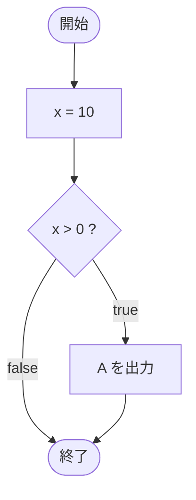

# IfTest11 — フローチャートとトレース表

- 対象ファイル: `src/IfTest11.java`
- パッケージ: デフォルト
- テーマ: 中括弧 `{}` 付きの基本的な if 文を学ぶ。条件が true のときだけブロック内が実行される。

## ソースの要点

```java
int x = 10;
if (x > 0) {
    System.out.println("A");
}
```

## フローチャート



## トレース表

| ステップ | 文 | x | 条件判定 | 出力 |
|---|---|---|---|---|
| 1 | `int x = 10` | 10 | - | - |
| 2 | `if (x > 0)` | 10 | `10 > 0` → true | - |
| 3 | `System.out.println("A")` | 10 | - | A |

## 実行結果（標準出力）

```
A
```

## 学習ポイント

- `if (条件) { 文 }` の最も基本的な形。
- ブロックを `{}` で囲むと複数文を書けるが、本サンプルでは 1 文のみ。
- 条件が `false` のときは何も出力されない。
