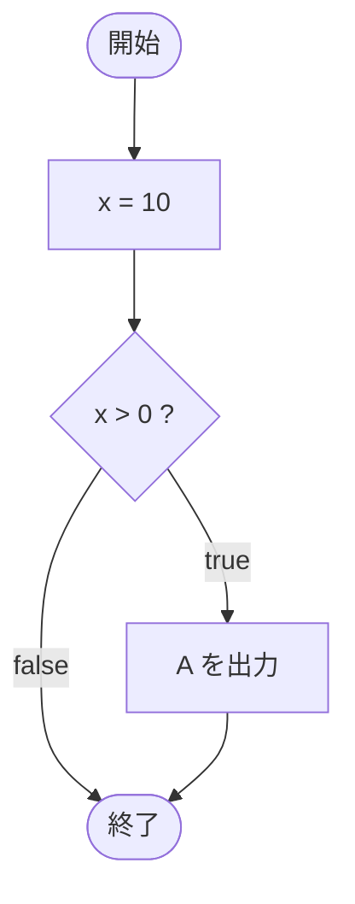

# IfTest12 — フローチャートとトレース表

- 対象ファイル: `src/IfTest12.java`
- パッケージ: デフォルト
- テーマ: 中括弧 `{}` を省略した if 文を学ぶ。条件が true のとき直後の 1 文だけが実行される。

## ソースの要点

```java
int x = 10;
if (x > 0)
    System.out.println("A");
```

## フローチャート



## トレース表

| ステップ | 文 | x | 条件判定 | 出力 |
|---|---|---|---|---|
| 1 | `int x = 10` | 10 | - | - |
| 2 | `if (x > 0)` | 10 | `10 > 0` → true | - |
| 3 | `System.out.println("A")` | 10 | - | A |

## 実行結果（標準出力）

```
A
```

## 学習ポイント

- `if` の本体が 1 文だけのとき、`{}` を省略できる。
- ただし、可読性とバグ防止のため、授業では `{}` を付ける流儀が推奨される。
- 次の `IfTest13` で `{}` 省略の落とし穴を確認する。
