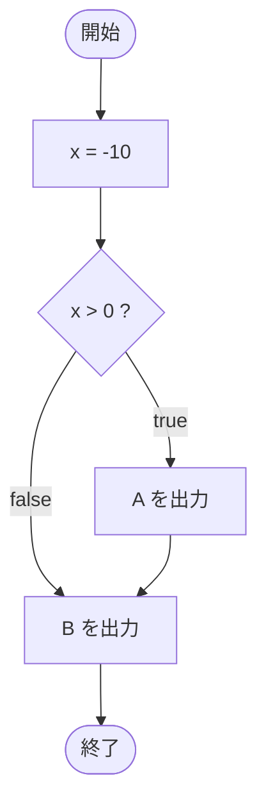

# IfTest13 — フローチャートとトレース表

- 対象ファイル: `src/IfTest13.java`
- パッケージ: デフォルト
- テーマ: `{}` を省略した if 文の落とし穴。直後の 1 文だけが if の本体で、その次の文は常に実行される。

## ソースの要点

```java
int x = -10;
if (x > 0)
    System.out.println("A");
System.out.println("B");
```

## フローチャート



## トレース表

| ステップ | 文 | x | 条件判定 | 出力 |
|---|---|---|---|---|
| 1 | `int x = -10` | -10 | - | - |
| 2 | `if (x > 0)` | -10 | `-10 > 0` → false | - |
| 3 | `System.out.println("A")` | - | - | （スキップ） |
| 4 | `System.out.println("B")` | -10 | - | B |

## 実行結果（標準出力）

```
B
```

## 学習ポイント

- `{}` を省略した if 文は、**直後の 1 文のみ**を本体とする。
- インデントだけで if の支配下にあるかのように見える文も、実際にはブロック外で常に実行される。
- 可読性のため、本体が 1 文でも `{}` を付けるのが安全。
