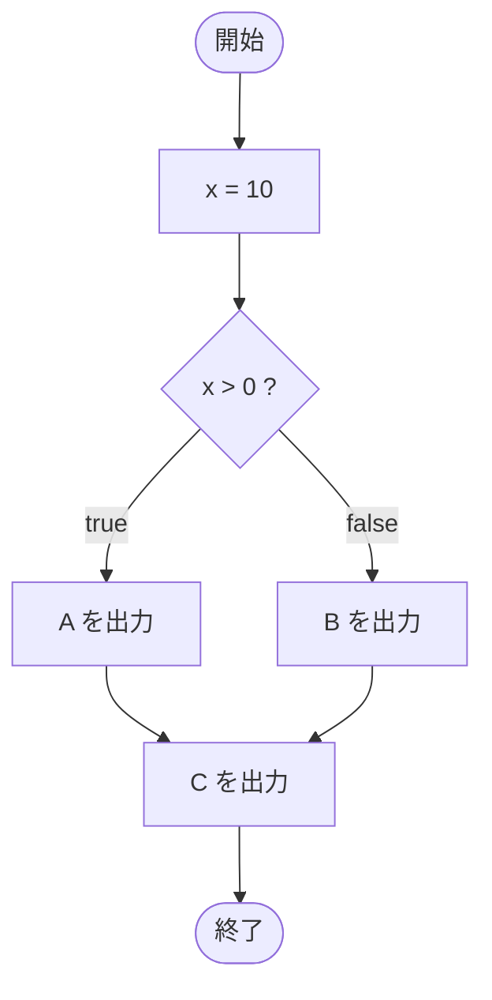

# IfTest14 — フローチャートとトレース表

- 対象ファイル: `src/IfTest14.java`
- パッケージ: デフォルト
- テーマ: `if-else` 文の基本。条件で 2 つに分岐し、その後の文は常に実行される。

## ソースの要点

```java
int x = 10;
if (x > 0)
    System.out.println("A");
else
    System.out.println("B");
System.out.println("C");
```

## フローチャート



## トレース表

| ステップ | 文 | x | 条件判定 | 出力 |
|---|---|---|---|---|
| 1 | `int x = 10` | 10 | - | - |
| 2 | `if (x > 0)` | 10 | `10 > 0` → true | - |
| 3 | `System.out.println("A")` | 10 | - | A |
| 4 | `System.out.println("C")` | 10 | - | C |

## 実行結果（標準出力）

```
A
C
```

## 学習ポイント

- `if (条件) ... else ...` で二者択一の分岐ができる。
- `else` 側の `System.out.println("B")` は条件 true のときスキップされる。
- if-else の後ろにある文（`C`）は常に実行される。
