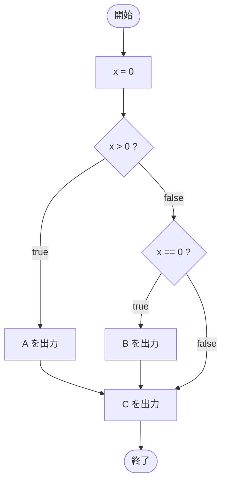

# IfTest15 — フローチャートとトレース表

- 対象ファイル: `src/IfTest15.java`
- パッケージ: デフォルト
- テーマ: `if-else if` 文の基本。else 節がなく、どちらにもマッチしないときは何もしない。

## ソースの要点

```java
int x = 0;
if (x > 0)
    System.out.println("A");
else if (x == 0)
    System.out.println("B");
System.out.println("C");
```

## フローチャート



## トレース表

| ステップ | 文 | x | 条件判定 | 出力 |
|---|---|---|---|---|
| 1 | `int x = 0` | 0 | - | - |
| 2 | `if (x > 0)` | 0 | `0 > 0` → false | - |
| 3 | `else if (x == 0)` | 0 | `0 == 0` → true | - |
| 4 | `System.out.println("B")` | 0 | - | B |
| 5 | `System.out.println("C")` | 0 | - | C |

## 実行結果（標準出力）

```
B
C
```

## 学習ポイント

- `else if` で条件を順に判定できる。
- else 節がない場合、すべての条件が false なら何も出力されない。
- if 文の後にある通常の文（`C`）は分岐結果に関わらず常に実行される。
