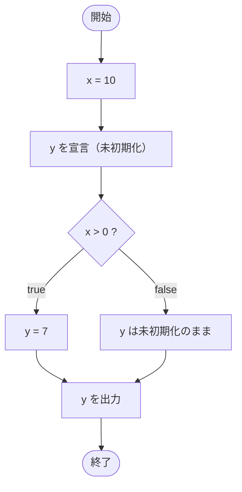

# IfTest21 — フローチャートとトレース表

- 対象ファイル: `src/IfTest21.java`
- パッケージ: デフォルト
- テーマ: ローカル変数の確定的代入のルール。if 内でのみ代入される変数を if の外で使うとコンパイルエラーになる。

## ソースの要点

```java
int x = 10;
int y;
if (x > 0) {
    y = 7;
}
// The local variable y may not have been initialized
System.out.println(y);
```

## フローチャート（コンパイル成功した想定の論理フロー）



## トレース表（仮にコンパイルが通った場合）

| ステップ | 文 | x | y | 条件判定 | 出力 |
|---|---|---|---|---|---|
| 1 | `int x = 10` | 10 | - | - | - |
| 2 | `int y;` | 10 | 未初期化 | - | - |
| 3 | `if (x > 0)` | 10 | 未初期化 | `10 > 0` → true | - |
| 4 | `y = 7` | 10 | 7 | - | - |
| 5 | `System.out.println(y)` | 10 | 7 | - | 7 |

## 実行結果（標準出力）

このコードはコンパイルエラーになる:

```
The local variable y may not have been initialized
```

## 学習ポイント

- このファイルは**コンパイルエラーを含む**学習用サンプル。
- Java は「ローカル変数の確定的代入」を要求する。if が false のとき `y` に値が入らない経路があるため、コンパイラは安全側に倒してエラーにする。
- 修正方法は `int y = 0;` のように宣言時に初期化するか、`else` 節を追加して全パスで代入すること（→ `IfTest23`）。
