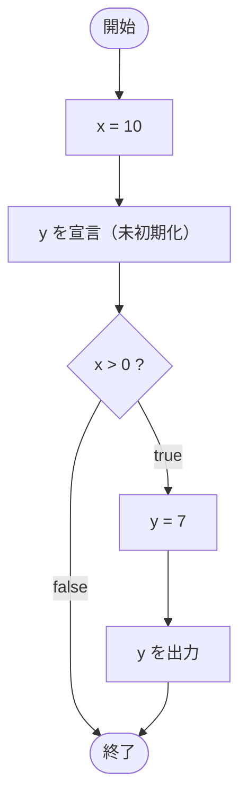

# IfTest22 — フローチャートとトレース表

- 対象ファイル: `src/IfTest22.java`
- パッケージ: デフォルト
- テーマ: 変数 `y` の利用を if ブロック内に限定すれば、未初期化エラーが出ない。

## ソースの要点

```java
int x = 10;
int y;
if (x > 0) {
    y = 7;
    System.out.println(y);
}
```

## フローチャート



## トレース表

| ステップ | 文 | x | y | 条件判定 | 出力 |
|---|---|---|---|---|---|
| 1 | `int x = 10` | 10 | - | - | - |
| 2 | `int y;` | 10 | 未初期化 | - | - |
| 3 | `if (x > 0)` | 10 | 未初期化 | `10 > 0` → true | - |
| 4 | `y = 7` | 10 | 7 | - | - |
| 5 | `System.out.println(y)` | 10 | 7 | - | 7 |

## 実行結果（標準出力）

```
7
```

## 学習ポイント

- if ブロック内で代入後に同じブロック内で使う分には、コンパイラは確定的代入を認識する。
- `int y;` のように宣言と初期化を分けてもよいが、利用範囲に注意する。
- `IfTest21` との違いは「`y` を if ブロックの中で使うか外で使うか」だけ。
