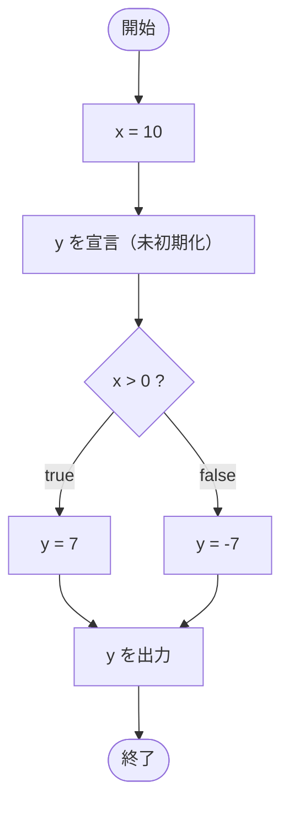

# IfTest23 — フローチャートとトレース表

- 対象ファイル: `src/IfTest23.java`
- パッケージ: デフォルト
- テーマ: if-else の両方で `y` に代入すれば、if の外で `y` を使ってもコンパイルエラーにならない。

## ソースの要点

```java
int x = 10;
int y;
if (x > 0) {
    y = 7;
} else {
    y = -7;
}
System.out.println(y);
```

## フローチャート



## トレース表

| ステップ | 文 | x | y | 条件判定 | 出力 |
|---|---|---|---|---|---|
| 1 | `int x = 10` | 10 | - | - | - |
| 2 | `int y;` | 10 | 未初期化 | - | - |
| 3 | `if (x > 0)` | 10 | 未初期化 | `10 > 0` → true | - |
| 4 | `y = 7` | 10 | 7 | - | - |
| 5 | `System.out.println(y)` | 10 | 7 | - | 7 |

## 実行結果（標準出力）

```
7
```

## 学習ポイント

- if と else の両方の経路で `y` に代入しているため、if の外側でも `y` は確実に初期化済みとみなされる。
- 「すべての経路で必ず代入される」とコンパイラが判断できれば、`int y;` の宣言だけでも利用可能。
- 確定的代入のルールを理解すると、未初期化エラーへの対処方法がわかる。
