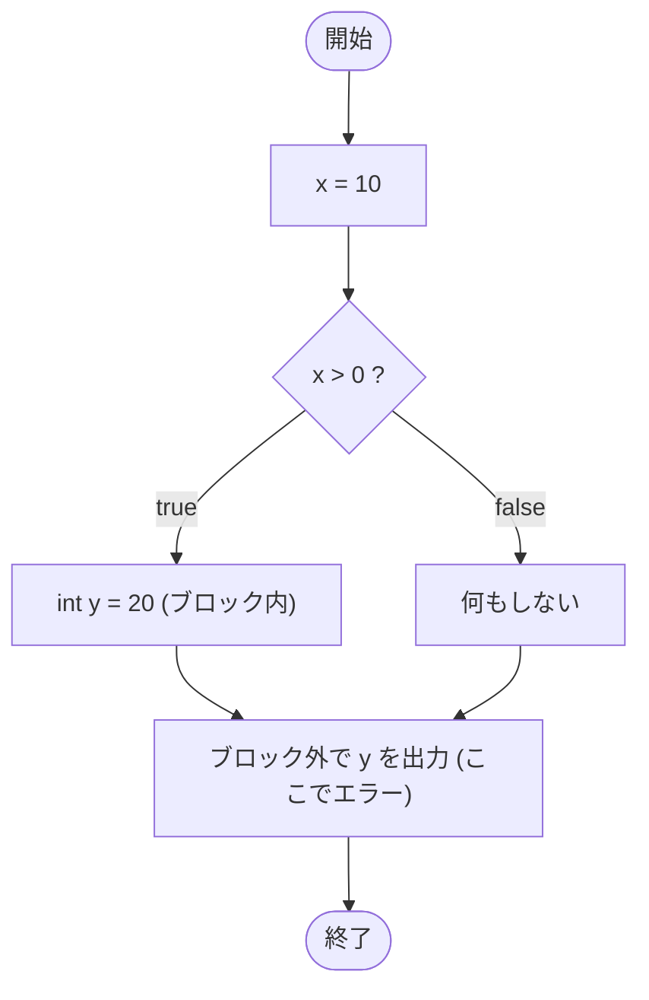

# IfTest31 — フローチャートとトレース表

- 対象ファイル: `src/IfTest31.java`
- パッケージ: デフォルト
- テーマ: ブロックスコープのルール。if ブロック内で宣言した変数は、ブロックの外では使えない。

## ソースの要点

```java
int x = 10;
if (x > 0) {
    int y = 20;
}
// 変数yのスコープ街で変数yを利用するコードなので、コンパイルエラーになる.
// y cannot be resolved to a variable
System.out.println(y);
```

## フローチャート（コンパイル成功した想定の論理フロー）



## トレース表（仮にコンパイルが通った場合）

| ステップ | 文 | x | y のスコープ | 出力 |
|---|---|---|---|---|
| 1 | `int x = 10` | 10 | - | - |
| 2 | `if (x > 0)` | 10 | - | - |
| 3 | `int y = 20` | 10 | if ブロック内のみ | - |
| 4 | `}` | 10 | y のスコープ終了 | - |
| 5 | `System.out.println(y)` | 10 | y は参照不能 | コンパイルエラー |

## 実行結果（標準出力）

このコードはコンパイルエラーになる:

```
y cannot be resolved to a variable
```

## 学習ポイント

- このファイルは**コンパイルエラーを含む**学習用サンプル。
- 変数のスコープは宣言した `{}` ブロック内に限定される。
- if ブロック内の `int y = 20` は、ブロックを抜けると参照できない。
- 解決策: `y` を if の外側で宣言するか、`y` の利用も if ブロック内に収める（→ `IfTest32`）。
