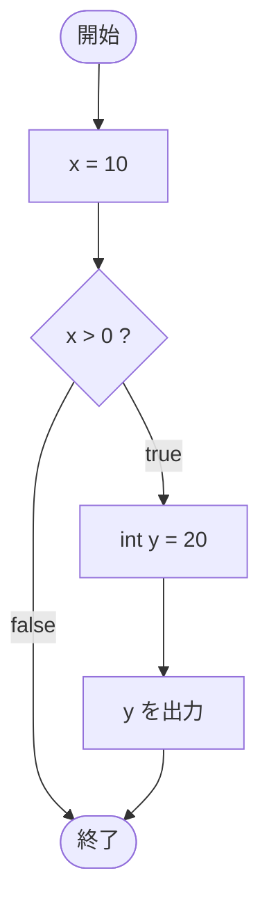

# IfTest32 — フローチャートとトレース表

- 対象ファイル: `src/IfTest32.java`
- パッケージ: デフォルト
- テーマ: if ブロック内で宣言した変数を同じブロック内で利用すれば、スコープ違反にならない。

## ソースの要点

```java
int x = 10;
if (x > 0) {
    int y = 20;
    System.out.println(y);
}
```

## フローチャート



## トレース表

| ステップ | 文 | x | y | 条件判定 | 出力 |
|---|---|---|---|---|---|
| 1 | `int x = 10` | 10 | - | - | - |
| 2 | `if (x > 0)` | 10 | - | `10 > 0` → true | - |
| 3 | `int y = 20` | 10 | 20 | - | - |
| 4 | `System.out.println(y)` | 10 | 20 | - | 20 |

## 実行結果（標準出力）

```
20
```

## 学習ポイント

- ブロック内で宣言・利用が完結していれば、スコープ違反にならない。
- `IfTest31` との違いは「`y` を if ブロックの中で出力するか外で出力するか」。
- ブロックスコープを理解すると、変数の有効範囲を意識して書けるようになる。
