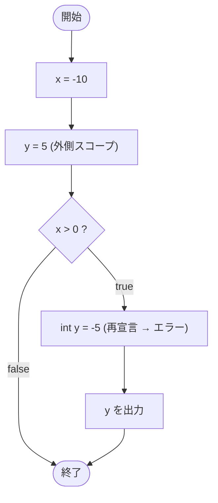

# IfTest33 — フローチャートとトレース表

- 対象ファイル: `src/IfTest33.java`
- パッケージ: デフォルト
- テーマ: 同じ名前のローカル変数を内側ブロックで再宣言するとコンパイルエラー。

## ソースの要点

```java
int x = -10;
int y = 5;
if (x > 0) {
    // Duplicate local variable y
    int y = -5;
    System.out.println(y);
}
```

## フローチャート（コンパイル成功した想定の論理フロー）



## トレース表（仮にコンパイルが通った場合）

| ステップ | 文 | x | 外側 y | 内側 y | 条件判定 | 出力 |
|---|---|---|---|---|---|---|
| 1 | `int x = -10` | -10 | - | - | - | - |
| 2 | `int y = 5` | -10 | 5 | - | - | - |
| 3 | `if (x > 0)` | -10 | 5 | - | `-10 > 0` → false | - |
| - | （ブロック内へ進まない） | -10 | 5 | - | - | - |

※ ただし実際にはコンパイルエラーで実行できない。

## 実行結果（標準出力）

このコードはコンパイルエラーになる:

```
Duplicate local variable y
```

## 学習ポイント

- このファイルは**コンパイルエラーを含む**学習用サンプル。
- Java では外側スコープと内側スコープで同名のローカル変数を宣言できない（C++ や JavaScript と異なるルール）。
- 解決策は内側で別名を使うか、`int y = -5;` ではなく `y = -5;` のように代入のみに変える。
