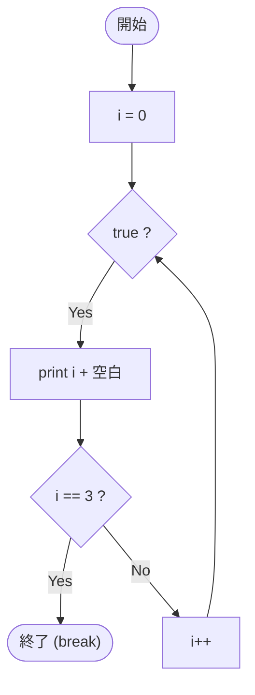

# SampleBreak03 — フローチャートとトレース表

- 対象ファイル: `src/vol06_02/SampleBreak03.java`
- パッケージ: `vol06_02`
- テーマ: 表示してから break する場合の動き（i==3 でも値が出力される）。

## ソースの要点

```java
int i = 0;
while (true) {
    System.out.print(i + " ");
    if (i == 3) {
        break;
    }
    i++;
}
```

## フローチャート



## トレース表

| ステップ | 文 | 実行前 i | 条件 i==3 | 実行後 i | 出力 | コメント |
|----|----|----|----|----|----|----|
| 1 | `int i = 0;` | - | - | 0 | （なし） | |
| 2 | `print(i + " ")` | 0 | - | 0 | `0 ` | |
| 3 | `if (i == 3)` | 0 | false | 0 | （なし） | break しない |
| 4 | `i++` | 0 | - | 1 | （なし） | |
| 5 | `print(i + " ")` | 1 | - | 1 | `1 ` | |
| 6 | `if (i == 3)` | 1 | false | 1 | （なし） | break しない |
| 7 | `i++` | 1 | - | 2 | （なし） | |
| 8 | `print(i + " ")` | 2 | - | 2 | `2 ` | |
| 9 | `if (i == 3)` | 2 | false | 2 | （なし） | break しない |
| 10 | `i++` | 2 | - | 3 | （なし） | |
| 11 | `print(i + " ")` | 3 | - | 3 | `3 ` | 表示してから判定 |
| 12 | `if (i == 3)` | 3 | true | 3 | （なし） | **break で抜ける** |

## 実行結果（標準出力）

```
0 1 2 3 
```

## 学習ポイント

- 「先に print → 後で break 判定」なので、3 も出力される。
- `SampleBreak01` の `i > 2` パターンとは判定タイミングが違うので結果も違う。
- break をどこに置くかで結果が変わる典型例。
