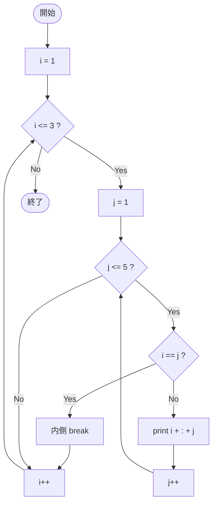

# SampleBreak04 — フローチャートとトレース表

- 対象ファイル: `src/vol06_02/SampleBreak04.java`
- パッケージ: `vol06_02`
- テーマ: 二重 for ループ内の `break`（内側ループだけを抜ける）。

## ソースの要点

```java
for (int i = 1; i <= 3; i++) {
    for (int j = 1; j <= 5; j++) {
        if (i == j) {
            break;        // 内側ループのみ抜ける
        }
        System.out.println(i + ":" + j);
    }
}
```

## フローチャート



## トレース表

| ステップ | 外側 i | 内側 j | i==j | 出力 | コメント |
|----|----|----|----|----|----|
| 1 | 1 | 1 | true | （なし） | **内側 break で抜ける** |
| 2 | 2 | 1 | false | `2:1` | |
| 3 | 2 | 2 | true | （なし） | **内側 break で抜ける** |
| 4 | 3 | 1 | false | `3:1` | |
| 5 | 3 | 2 | false | `3:2` | |
| 6 | 3 | 3 | true | （なし） | **内側 break で抜ける** |
| 7 | i=4 | - | - | （なし） | 外側 条件 false で終了 |

## 実行結果（標準出力）

```
2:1
3:1
3:2
```

## 学習ポイント

- 通常の `break` は **最も内側のループだけ** を抜ける。
- 外側のループは継続するので、i は次の値に進む。
- 二重ループの両方を抜けたい場合は、後の `SampleLabel01` のようにラベル付き break を使う。
