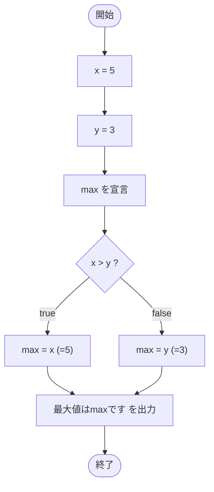

# SampleConditional01 — フローチャートとトレース表

- 対象ファイル: `src/SampleConditional01.java`
- パッケージ: デフォルト
- テーマ: 三項演算子（条件演算子）`? :` を使って 2 値の最大値を求めるサンプル。

## ソースの要点

```java
int x = 5;
int y = 3;
int max;
max = (x > y) ? x : y;
System.out.println("最大値は" + max + "です");
```

## フローチャート



## トレース表

| ステップ | 文 | x | y | max | 条件判定 | 出力 |
|---|---|---|---|---|---|---|
| 1 | `int x = 5` | 5 | - | - | - | - |
| 2 | `int y = 3` | 5 | 3 | - | - | - |
| 3 | `int max;` | 5 | 3 | 未初期化 | - | - |
| 4 | `max = (x > y) ? x : y` | 5 | 3 | 5 | `5 > 3` → true | - |
| 5 | `System.out.println(...)` | 5 | 3 | 5 | - | 最大値は5です |

## 実行結果（標準出力）

```
最大値は5です
```

## 学習ポイント

- 三項演算子 `条件 ? 式1 : 式2` は、条件が true なら式1、false なら式2を返す。
- if-else より簡潔に値を選択できる。
- 式なので代入や `println` の引数に直接書ける。
