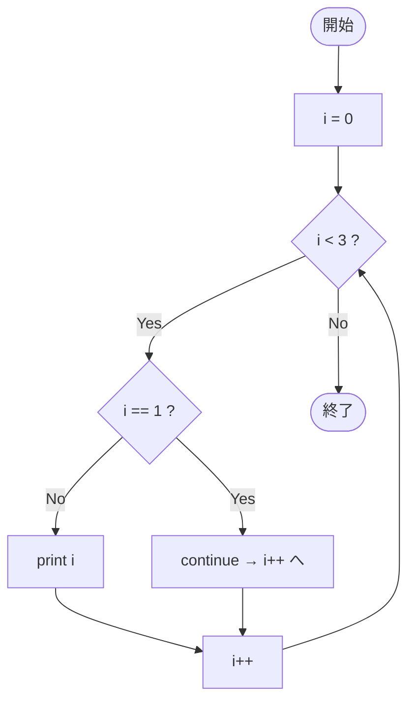

# SampleContinue01 — フローチャートとトレース表

- 対象ファイル: `src/vol06_02/SampleContinue01.java`
- パッケージ: `vol06_02`
- テーマ: `continue` で残りの本体をスキップして次の反復へ進む基本例。

## ソースの要点

```java
for (int i = 0; i < 3; i++) {
    if (i == 1) {
        continue;       // 残りをスキップ → 次の反復へ
    }
    System.out.println(i);
}
```

## フローチャート



## トレース表

| ステップ | i | 条件 i<3 | i==1 | 出力 | コメント |
|----|----|----|----|----|----|
| 1 | 0 | true | false | `0` | 通常実行 |
| 2 | 1 | true | true | （なし） | **continue で次の反復へ** |
| 3 | 2 | true | false | `2` | 通常実行 |
| 4 | 3 | false | - | （なし） | ループを抜ける |

## 実行結果（標準出力）

```
0
2
```

## 学習ポイント

- `continue` は本体の残りをスキップし、更新式と条件判定に進む。
- `break` はループ全体を抜けるが、`continue` はその反復だけスキップ。
- 結果として、特定の値のときだけ処理を飛ばす書き方ができる。
