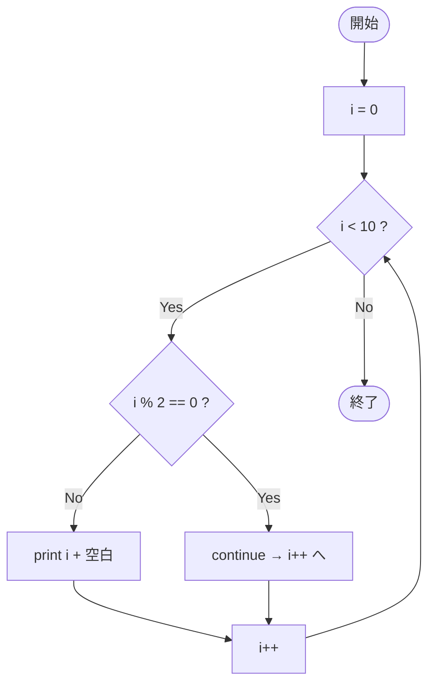

# SampleContinue02 — フローチャートとトレース表

- 対象ファイル: `src/vol06_02/SampleContinue02.java`
- パッケージ: `vol06_02`
- テーマ: `continue` を使って偶数をスキップし、奇数だけ表示する。

## ソースの要点

```java
for (int i = 0; i < 10; i++) {
    if (i % 2 == 0) {
        continue;       // 偶数ならスキップ
    }
    System.out.print(i + " ");
}
```

## フローチャート



## トレース表

| ステップ | i | 条件 i<10 | i%2==0 | 出力 | コメント |
|----|----|----|----|----|----|
| 1 | 0 | true | true | （なし） | **continue** |
| 2 | 1 | true | false | `1 ` | 出力 |
| 3 | 2 | true | true | （なし） | **continue** |
| 4 | 3 | true | false | `3 ` | 出力 |
| 5 | 4 | true | true | （なし） | **continue** |
| 6 | 5 | true | false | `5 ` | 出力 |
| 7 | 6 | true | true | （なし） | **continue** |
| 8 | 7 | true | false | `7 ` | 出力 |
| 9 | 8 | true | true | （なし） | **continue** |
| 10 | 9 | true | false | `9 ` | 出力 |
| 11 | 10 | false | - | （なし） | ループを抜ける |

## 実行結果（標準出力）

```
1 3 5 7 9 
```

## 学習ポイント

- `i % 2 == 0` で偶数を判定（剰余演算子の典型用途）。
- 偶数を continue でスキップすることで、奇数だけが出力される。
- 同じ動きを `if (i % 2 != 0) print(i);` で書くこともできる。
