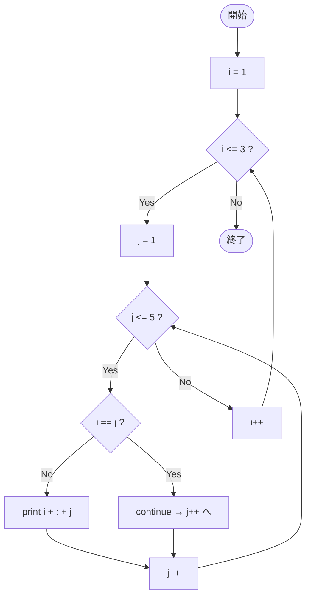

# SampleContinue03 — フローチャートとトレース表

- 対象ファイル: `src/vol06_02/SampleContinue03.java`
- パッケージ: `vol06_02`
- テーマ: 二重 for ループ内の `continue`（内側ループの次の反復へ）。

## ソースの要点

```java
for (int i = 1; i <= 3; i++) {
    for (int j = 1; j <= 5; j++) {
        if (i == j) {
            continue;       // 内側ループの次の j へ
        }
        System.out.println(i + ":" + j);
    }
}
```

## フローチャート



## トレース表

| ステップ | 外側 i | 内側 j | i==j | 出力 | コメント |
|----|----|----|----|----|----|
| 1 | 1 | 1 | true | （なし） | **continue で次の j へ** |
| 2 | 1 | 2 | false | `1:2` | |
| 3 | 1 | 3 | false | `1:3` | |
| 4 | 1 | 4 | false | `1:4` | |
| 5 | 1 | 5 | false | `1:5` | |
| 6 | 2 | 1 | false | `2:1` | |
| 7 | 2 | 2 | true | （なし） | **continue で次の j へ** |
| 8 | 2 | 3 | false | `2:3` | |
| 9 | 2 | 4 | false | `2:4` | |
| 10 | 2 | 5 | false | `2:5` | |
| 11 | 3 | 1 | false | `3:1` | |
| 12 | 3 | 2 | false | `3:2` | |
| 13 | 3 | 3 | true | （なし） | **continue で次の j へ** |
| 14 | 3 | 4 | false | `3:4` | |
| 15 | 3 | 5 | false | `3:5` | |
| 16 | i=4 | - | - | （なし） | 外側 false で終了 |

## 実行結果（標準出力）

```
1:2
1:3
1:4
1:5
2:1
2:3
2:4
2:5
3:1
3:2
3:4
3:5
```

## 学習ポイント

- 二重ループの `continue` は **最も内側のループの次の反復へ** 進む。
- 外側ループには影響しない。
- `SampleBreak04` と比較すると、break と continue の違いがよく分かる。
