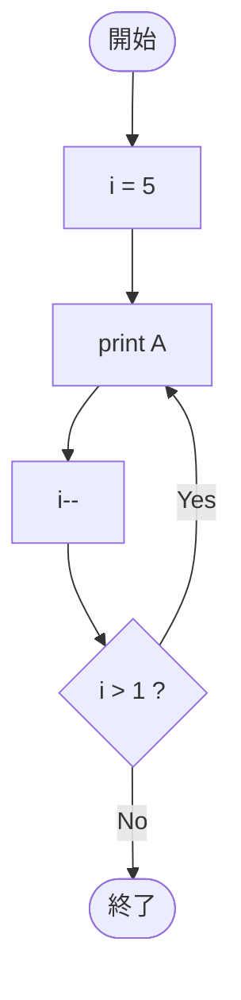

# SampleDoWhile01 — フローチャートとトレース表

- 対象ファイル: `src/vol06_02/SampleDoWhile01.java`
- パッケージ: `vol06_02`
- テーマ: do-while 文の基本（後判定）。

## ソースの要点

```java
int i = 5;
do {
    System.out.print("A");
    i--;
} while (i > 1);
```

## フローチャート



## トレース表

| ステップ | 文 | 実行前 i | 実行後 i | 条件 i>1 | 出力 |
|----|----|----|----|----|----|
| 1 | `int i = 5;` | - | 5 | - | （なし） |
| 2 | `print("A")` | 5 | 5 | - | `A` |
| 3 | `i--` | 5 | 4 | - | （なし） |
| 4 | 条件判定 | 4 | 4 | true | （なし） |
| 5 | `print("A")` | 4 | 4 | - | `A` |
| 6 | `i--` | 4 | 3 | - | （なし） |
| 7 | 条件判定 | 3 | 3 | true | （なし） |
| 8 | `print("A")` | 3 | 3 | - | `A` |
| 9 | `i--` | 3 | 2 | - | （なし） |
| 10 | 条件判定 | 2 | 2 | true | （なし） |
| 11 | `print("A")` | 2 | 2 | - | `A` |
| 12 | `i--` | 2 | 1 | - | （なし） |
| 13 | 条件判定 | 1 | 1 | false | ループを抜ける |

## 実行結果（標準出力）

```
AAAA
```

## 学習ポイント

- do-while は本体を 1 回必ず実行してから条件判定する（後判定）。
- 一方 while は条件判定が先（前判定）。最初から条件が false なら本体は 0 回。
- ループ内の `print` は改行なしの `print` なので、`A` が連続して出力される。
