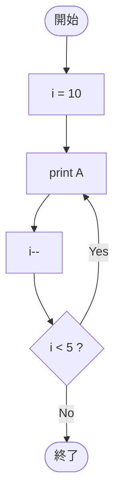

# SampleDoWhile02 — フローチャートとトレース表

- 対象ファイル: `src/vol06_02/SampleDoWhile02.java`
- パッケージ: `vol06_02`
- テーマ: do-while で「最初から条件 false」になる場合の挙動（1 回だけ実行される）。

## ソースの要点

```java
int i = 10;
do {
    System.out.println("A");
    i--;
} while (i < 5);
```

## フローチャート



## トレース表

| ステップ | 文 | 実行前 i | 実行後 i | 条件 i<5 | 出力 |
|----|----|----|----|----|----|
| 1 | `int i = 10;` | - | 10 | - | （なし） |
| 2 | `println("A")` | 10 | 10 | - | `A` |
| 3 | `i--` | 10 | 9 | - | （なし） |
| 4 | 条件判定 | 9 | 9 | false | ループを抜ける |

## 実行結果（標準出力）

```
A
```

## 学習ポイント

- do-while は条件が最初から false でも、本体が必ず 1 回実行される。
- while だった場合、条件 `10 < 5` が false なので一度も実行されない。
- 「最低 1 回は処理したい」場合に do-while を使う。
