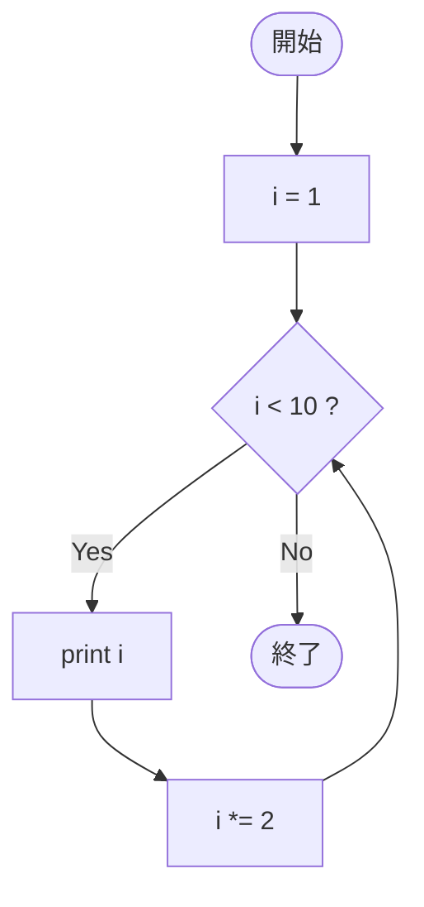

# SampleFor02 — フローチャートとトレース表

- 対象ファイル: `src/vol06_02/SampleFor02.java`
- パッケージ: `vol06_02`
- テーマ: 更新式が `i *= 2` のように加算以外の場合の for 文。

## ソースの要点

```java
int i;
for (i = 1; i < 10; i *= 2) {
    System.out.println(i);
}
```

## フローチャート



## トレース表

| ステップ | 文 | 実行前 i | 条件 i<10 | 実行後 i | 出力 |
|----|----|----|----|----|----|
| 1 | `i = 1` | - | - | 1 | （なし） |
| 2 | 条件判定 | 1 | true | 1 | （なし） |
| 3 | `println(i)` | 1 | - | 1 | `1` |
| 4 | `i *= 2` | 1 | - | 2 | （なし） |
| 5 | 条件判定 | 2 | true | 2 | （なし） |
| 6 | `println(i)` | 2 | - | 2 | `2` |
| 7 | `i *= 2` | 2 | - | 4 | （なし） |
| 8 | 条件判定 | 4 | true | 4 | （なし） |
| 9 | `println(i)` | 4 | - | 4 | `4` |
| 10 | `i *= 2` | 4 | - | 8 | （なし） |
| 11 | 条件判定 | 8 | true | 8 | （なし） |
| 12 | `println(i)` | 8 | - | 8 | `8` |
| 13 | `i *= 2` | 8 | - | 16 | （なし） |
| 14 | 条件判定 | 16 | false | 16 | ループを抜ける |

## 実行結果（標準出力）

```
1
2
4
8
```

## 学習ポイント

- for の更新式は `i++` だけでなく `i *= 2` や `i -= 3` なども書ける。
- 等比数列（1, 2, 4, 8, ...）のような繰り返しを簡潔に表現できる。
- 条件式の境界値（ここでは 10）と更新の組み合わせで終了条件が決まる。
