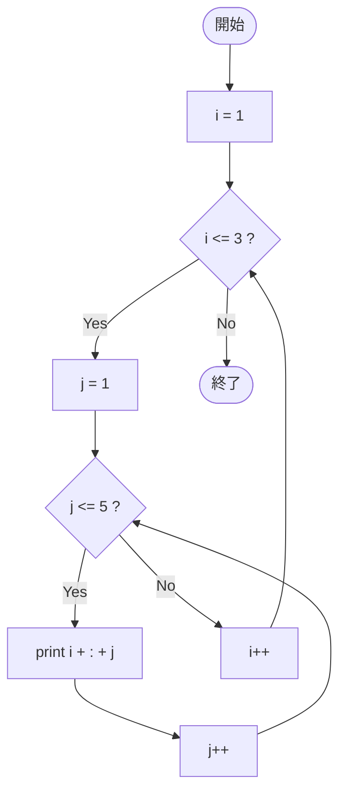

# SampleFor03 — フローチャートとトレース表

- 対象ファイル: `src/vol06_02/SampleFor03.java`
- パッケージ: `vol06_02`
- テーマ: for 文の二重ループ。

## ソースの要点

```java
for (int i = 1; i <= 3; i++) {
    for (int j = 1; j <= 5; j++) {
        System.out.println(i + ":" + j);
    }
}
```

## フローチャート



## トレース表

| ステップ | 外側 i | 内側 j | 条件 | 出力 | コメント |
|----|----|----|----|----|----|
| 1 | 1 | - | i<=3 true | （なし） | 外側に入る |
| 2 | 1 | 1 | j<=5 true | `1:1` | |
| 3 | 1 | 2 | j<=5 true | `1:2` | |
| 4 | 1 | 3 | j<=5 true | `1:3` | |
| 5 | 1 | 4 | j<=5 true | `1:4` | |
| 6 | 1 | 5 | j<=5 true | `1:5` | |
| 7 | 1 | 6 | j<=5 false | （なし） | 内側を抜ける |
| 8 | 2 | - | i<=3 true | （なし） | i++ 後、再度外側へ |
| 9 | 2 | 1 | j<=5 true | `2:1` | |
| 10 | 2 | 2 | j<=5 true | `2:2` | |
| 11 | 2 | 3 | j<=5 true | `2:3` | |
| 12 | 2 | 4 | j<=5 true | `2:4` | |
| 13 | 2 | 5 | j<=5 true | `2:5` | |
| 14 | 2 | 6 | j<=5 false | （なし） | 内側を抜ける |
| 15 | 3 | - | i<=3 true | （なし） | |
| 16 | 3 | 1 | j<=5 true | `3:1` | |
| 17 | 3 | 2 | j<=5 true | `3:2` | |
| 18 | 3 | 3 | j<=5 true | `3:3` | |
| 19 | 3 | 4 | j<=5 true | `3:4` | |
| 20 | 3 | 5 | j<=5 true | `3:5` | |
| 21 | 3 | 6 | j<=5 false | （なし） | 内側を抜ける |
| 22 | 4 | - | i<=3 false | （なし） | 外側を抜ける |

## 実行結果（標準出力）

```
1:1
1:2
1:3
1:4
1:5
2:1
2:2
2:3
2:4
2:5
3:1
3:2
3:3
3:4
3:5
```

## 学習ポイント

- 二重ループでは、外側 1 回ごとに内側を最後まで実行する。
- 合計の実行回数は外側 × 内側 = 3 × 5 = 15 回。
- 変数 `i`, `j` は for 文の中で宣言しているのでループ後は使えない。
