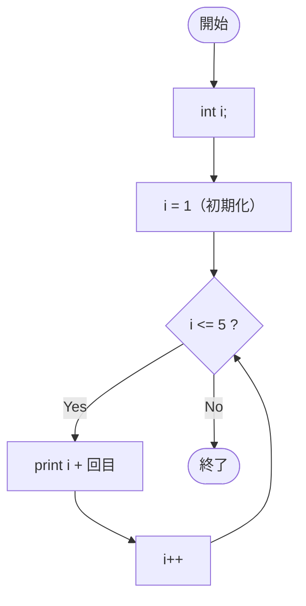

# SampleFor03b — フローチャートとトレース表

- 対象ファイル: `src/vol06_02/SampleFor03b.java`
- パッケージ: `vol06_02`
- テーマ: 変数 `i` を for の外で宣言し、初期化部で代入する形。

## ソースの要点

```java
int i;
for (i = 1; i <= 5; i++) {
    System.out.println(i + "回目");
}
```

## フローチャート



## トレース表

| ステップ | 文 | 実行前 i | 条件 i<=5 | 実行後 i | 出力 |
|----|----|----|----|----|----|
| 1 | `int i;` | - | - | 未初期化 | （なし） |
| 2 | `i = 1` | 未初期化 | - | 1 | （なし） |
| 3 | 条件判定 | 1 | true | 1 | （なし） |
| 4 | `println` | 1 | - | 1 | `1回目` |
| 5 | `i++` | 1 | - | 2 | （なし） |
| 6 | 条件判定 | 2 | true | 2 | （なし） |
| 7 | `println` | 2 | - | 2 | `2回目` |
| 8 | `i++` | 2 | - | 3 | （なし） |
| 9 | 条件判定 | 3 | true | 3 | （なし） |
| 10 | `println` | 3 | - | 3 | `3回目` |
| 11 | `i++` | 3 | - | 4 | （なし） |
| 12 | 条件判定 | 4 | true | 4 | （なし） |
| 13 | `println` | 4 | - | 4 | `4回目` |
| 14 | `i++` | 4 | - | 5 | （なし） |
| 15 | 条件判定 | 5 | true | 5 | （なし） |
| 16 | `println` | 5 | - | 5 | `5回目` |
| 17 | `i++` | 5 | - | 6 | （なし） |
| 18 | 条件判定 | 6 | false | 6 | ループを抜ける |

## 実行結果（標準出力）

```
1回目
2回目
3回目
4回目
5回目
```

## 学習ポイント

- for の初期化部は変数宣言だけでなく、既存変数への代入も書ける。
- 外側で宣言した `i` を使うと、ループ後にも `i` の値（最終的に 6）を参照できる。
- 通常は `SampleFor03a` のように for の中で宣言する方がスコープが狭く安全。
