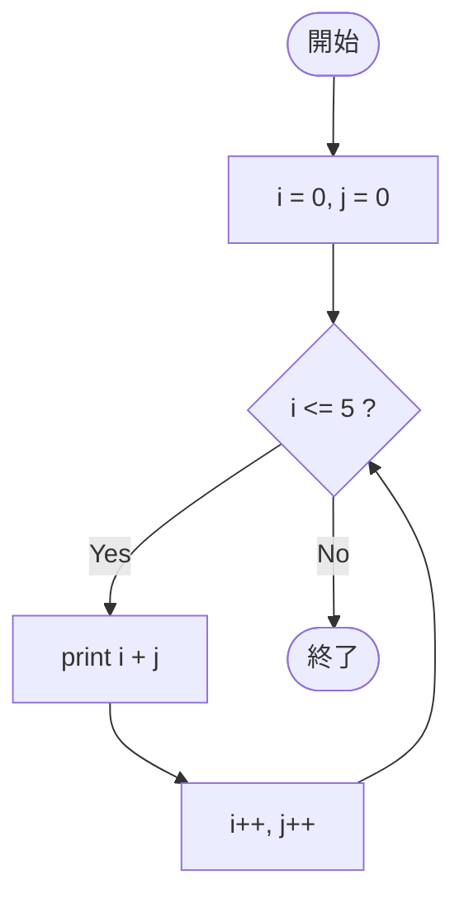

# SampleFor03d — フローチャートとトレース表

- 対象ファイル: `src/vol06_02/SampleFor03d.java`
- パッケージ: `vol06_02`
- テーマ: for の初期化部・更新式でカンマ演算子を使って複数の変数を扱う。

## ソースの要点

```java
int i, j;
for (i = 0, j = 0; i <= 5; i++, j++) {
    System.out.println(i + j);
}
```

## フローチャート



## トレース表

| ステップ | 文 | 実行前 i | 実行前 j | 条件 i<=5 | 実行後 i | 実行後 j | 出力 |
|----|----|----|----|----|----|----|----|
| 1 | `i = 0, j = 0` | - | - | - | 0 | 0 | （なし） |
| 2 | 条件判定 | 0 | 0 | true | 0 | 0 | （なし） |
| 3 | `println(i + j)` | 0 | 0 | - | 0 | 0 | `0` |
| 4 | `i++, j++` | 0 | 0 | - | 1 | 1 | （なし） |
| 5 | 条件判定 | 1 | 1 | true | 1 | 1 | （なし） |
| 6 | `println(i + j)` | 1 | 1 | - | 1 | 1 | `2` |
| 7 | `i++, j++` | 1 | 1 | - | 2 | 2 | （なし） |
| 8 | 条件判定 | 2 | 2 | true | 2 | 2 | （なし） |
| 9 | `println(i + j)` | 2 | 2 | - | 2 | 2 | `4` |
| 10 | `i++, j++` | 2 | 2 | - | 3 | 3 | （なし） |
| 11 | 条件判定 | 3 | 3 | true | 3 | 3 | （なし） |
| 12 | `println(i + j)` | 3 | 3 | - | 3 | 3 | `6` |
| 13 | `i++, j++` | 3 | 3 | - | 4 | 4 | （なし） |
| 14 | 条件判定 | 4 | 4 | true | 4 | 4 | （なし） |
| 15 | `println(i + j)` | 4 | 4 | - | 4 | 4 | `8` |
| 16 | `i++, j++` | 4 | 4 | - | 5 | 5 | （なし） |
| 17 | 条件判定 | 5 | 5 | true | 5 | 5 | （なし） |
| 18 | `println(i + j)` | 5 | 5 | - | 5 | 5 | `10` |
| 19 | `i++, j++` | 5 | 5 | - | 6 | 6 | （なし） |
| 20 | 条件判定 | 6 | 6 | false | 6 | 6 | ループを抜ける |

## 実行結果（標準出力）

```
0
2
4
6
8
10
```

## 学習ポイント

- for の初期化部・更新式は、カンマ区切りで複数並べられる。
- ただし条件式は 1 つだけ（`&&` や `||` で組み合わせる）。
- 二つの変数を同期して動かしたいときに便利。
