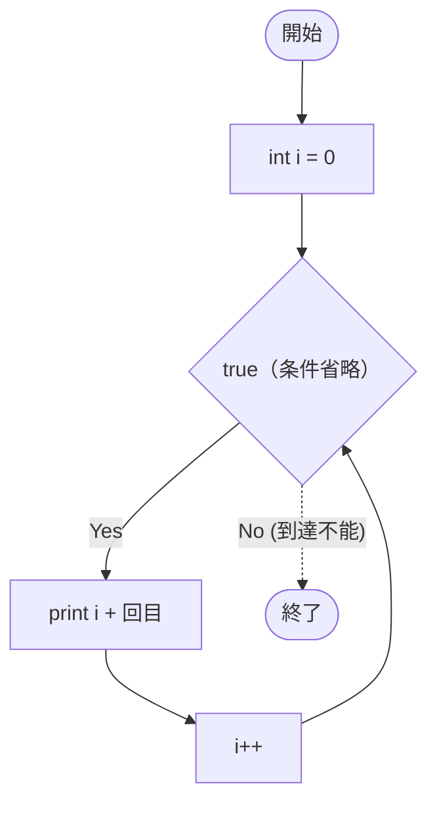

# SampleFor03e — フローチャートとトレース表

- 対象ファイル: `src/vol06_02/SampleFor03e.java`
- パッケージ: `vol06_02`
- テーマ: for の条件式を省略すると無限ループになる。

## ソースの要点

```java
for (int i = 0;; i++) {     // 条件式を省略 → 常に true
    System.out.println(i + "回目");
}
```

## フローチャート



## トレース表

| ステップ | 文 | 実行前 i | 条件 | 実行後 i | 出力 |
|----|----|----|----|----|----|
| 1 | `int i = 0` | - | - | 0 | （なし） |
| 2 | 条件判定 | 0 | true | 0 | （なし） |
| 3 | `println` | 0 | - | 0 | `0回目` |
| 4 | `i++` | 0 | - | 1 | （なし） |
| 5 | 条件判定 | 1 | true | 1 | （なし） |
| 6 | `println` | 1 | - | 1 | `1回目` |
| 7 | `i++` | 1 | - | 2 | （なし） |
| 8 | 条件判定 | 2 | true | 2 | （なし） |
| 9 | `println` | 2 | - | 2 | `2回目` |
| ... | ...（永遠に継続） | ... | true | ... | `3回目`, `4回目`, ... |

## 実行結果（標準出力）

```
0回目
1回目
2回目
3回目
...（無限に続く。Ctrl+C で強制終了する必要がある）
```

## 学習ポイント

- for の条件式を省略すると、常に true として扱われる（無限ループ）。
- `while (true)` と等価。
- 強制終了か `break` 文がないと止まらない。
