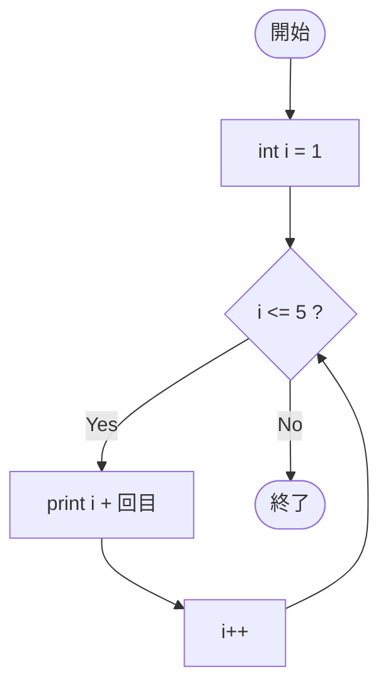

# SampleFor03f — フローチャートとトレース表

- 対象ファイル: `src/vol06_02/SampleFor03f.java`
- パッケージ: `vol06_02`
- テーマ: for の更新式を省略し、本体内で `i++` する書き方。

## ソースの要点

```java
for (int i = 1; i <= 5;) {   // 更新式を省略
    System.out.println(i + "回目");
    i++;                     // 本体の中で更新
}
```

## フローチャート



## トレース表

| ステップ | 文 | 実行前 i | 条件 i<=5 | 実行後 i | 出力 |
|----|----|----|----|----|----|
| 1 | `int i = 1` | - | - | 1 | （なし） |
| 2 | 条件判定 | 1 | true | 1 | （なし） |
| 3 | `println` | 1 | - | 1 | `1回目` |
| 4 | `i++`（本体内） | 1 | - | 2 | （なし） |
| 5 | 条件判定 | 2 | true | 2 | （なし） |
| 6 | `println` | 2 | - | 2 | `2回目` |
| 7 | `i++`（本体内） | 2 | - | 3 | （なし） |
| 8 | 条件判定 | 3 | true | 3 | （なし） |
| 9 | `println` | 3 | - | 3 | `3回目` |
| 10 | `i++`（本体内） | 3 | - | 4 | （なし） |
| 11 | 条件判定 | 4 | true | 4 | （なし） |
| 12 | `println` | 4 | - | 4 | `4回目` |
| 13 | `i++`（本体内） | 4 | - | 5 | （なし） |
| 14 | 条件判定 | 5 | true | 5 | （なし） |
| 15 | `println` | 5 | - | 5 | `5回目` |
| 16 | `i++`（本体内） | 5 | - | 6 | （なし） |
| 17 | 条件判定 | 6 | false | 6 | ループを抜ける |

## 実行結果（標準出力）

```
1回目
2回目
3回目
4回目
5回目
```

## 学習ポイント

- for の更新式は省略できる（`;` は残す）。
- その場合、本体内で更新しないと無限ループになる。
- while 文に近い書き方になるが、初期化と条件は for の構文を活かせる。
