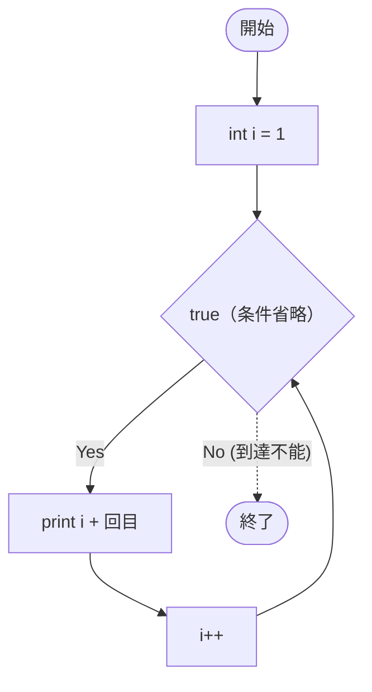

# SampleFor03g — フローチャートとトレース表

- 対象ファイル: `src/vol06_02/SampleFor03g.java`
- パッケージ: `vol06_02`
- テーマ: for の三つの式すべてを省略する書き方（`for (;;)` = 無限ループ）。

## ソースの要点

```java
int i = 1;
for (;;) {                  // 初期化・条件・更新をすべて省略
    System.out.println(i + "回目");
    i++;
}
```

## フローチャート



## トレース表

| ステップ | 文 | 実行前 i | 条件 | 実行後 i | 出力 |
|----|----|----|----|----|----|
| 1 | `int i = 1;` | - | - | 1 | （なし） |
| 2 | 条件判定 | 1 | true | 1 | （なし） |
| 3 | `println` | 1 | - | 1 | `1回目` |
| 4 | `i++` | 1 | - | 2 | （なし） |
| 5 | 条件判定 | 2 | true | 2 | （なし） |
| 6 | `println` | 2 | - | 2 | `2回目` |
| 7 | `i++` | 2 | - | 3 | （なし） |
| 8 | 条件判定 | 3 | true | 3 | （なし） |
| 9 | `println` | 3 | - | 3 | `3回目` |
| ... | ...（永遠に継続） | ... | true | ... | `4回目`, `5回目`, ... |

## 実行結果（標準出力）

```
1回目
2回目
3回目
4回目
...（無限に続く。Ctrl+C で強制終了する必要がある）
```

## 学習ポイント

- `for (;;)` は無限ループのイディオム（`while (true)` と同等）。
- 三つの式は省略できるが、`;` は必ず 2 つ書く。
- 抜けるには `break` か例外送出が必要。
