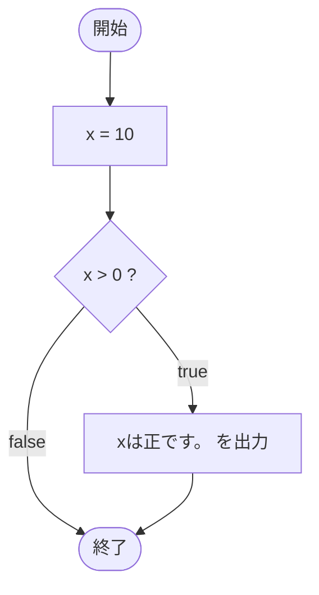

# SampleIf01 — フローチャートとトレース表

- 対象ファイル: `src/SampleIf01.java`
- パッケージ: デフォルト
- テーマ: 最も基本的な if 文。条件が true のときだけメッセージを出力する。

## ソースの要点

```java
int x = 10;
if (x > 0) {
    System.out.println("xは正です。");
}
```

## フローチャート



## トレース表

| ステップ | 文 | x | 条件判定 | 出力 |
|---|---|---|---|---|
| 1 | `int x = 10` | 10 | - | - |
| 2 | `if (x > 0)` | 10 | `10 > 0` → true | - |
| 3 | `System.out.println("xは正です。")` | 10 | - | xは正です。 |

## 実行結果（標準出力）

```
xは正です。
```

## 学習ポイント

- `if (条件) { 文; }` の最も基本的な形。
- 条件が true のときだけブロック内が実行される。
- 条件が false のとき、ブロックはまるごとスキップされる。
