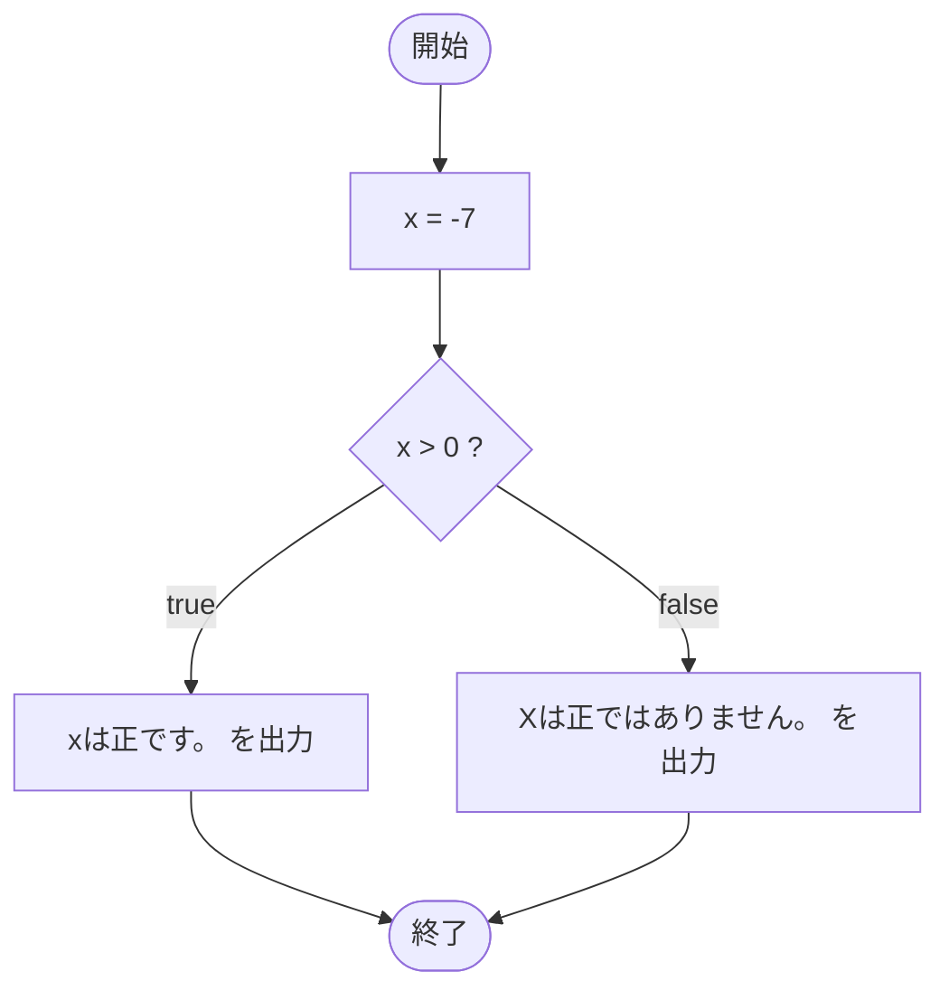

# SampleIf02 — フローチャートとトレース表

- 対象ファイル: `src/SampleIf02.java`
- パッケージ: デフォルト
- テーマ: `if-else` 文。条件で 2 つに分岐する。

## ソースの要点

```java
int x = -7;
if (x > 0) {
    System.out.println("xは正です。");
} else {
    System.out.println("Xは正ではありません。");
}
```

## フローチャート



## トレース表

| ステップ | 文 | x | 条件判定 | 出力 |
|---|---|---|---|---|
| 1 | `int x = -7` | -7 | - | - |
| 2 | `if (x > 0)` | -7 | `-7 > 0` → false | - |
| 3 | `else` ブロックへ | -7 | - | - |
| 4 | `System.out.println("Xは正ではありません。")` | -7 | - | Xは正ではありません。 |

## 実行結果（標準出力）

```
Xは正ではありません。
```

## 学習ポイント

- `if-else` で必ずどちらか一方の処理が実行される。
- 条件 `x > 0` が false なので else 側に進む。
- ゼロは「正」に含まれないことに注意（`>` であって `>=` ではない）。
