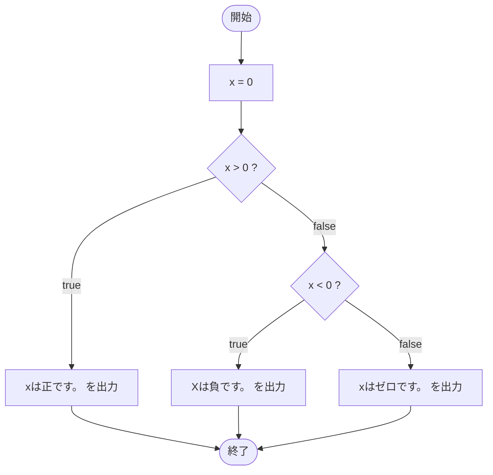

# SampleIf03 — フローチャートとトレース表

- 対象ファイル: `src/SampleIf03.java`
- パッケージ: デフォルト
- テーマ: `if-else if-else` による多分岐。正・負・ゼロの 3 通りに分岐する。

## ソースの要点

```java
int x = 0;
if (x > 0) {
    System.out.println("xは正です。");
} else if (x < 0) {
    System.out.println("Xは負です。");
} else {
    System.out.println("xはゼロです。");
}
```

## フローチャート



## トレース表

| ステップ | 文 | x | 条件判定 | 出力 |
|---|---|---|---|---|
| 1 | `int x = 0` | 0 | - | - |
| 2 | `if (x > 0)` | 0 | `0 > 0` → false | - |
| 3 | `else if (x < 0)` | 0 | `0 < 0` → false | - |
| 4 | `else` ブロックへ | 0 | - | - |
| 5 | `System.out.println("xはゼロです。")` | 0 | - | xはゼロです。 |

## 実行結果（標準出力）

```
xはゼロです。
```

## 学習ポイント

- `else if` を使うと 3 通り以上の分岐ができる。
- 条件は上から順に判定され、最初に true になった分岐だけが実行される。
- どの条件にも当てはまらないとき `else` が実行される。
