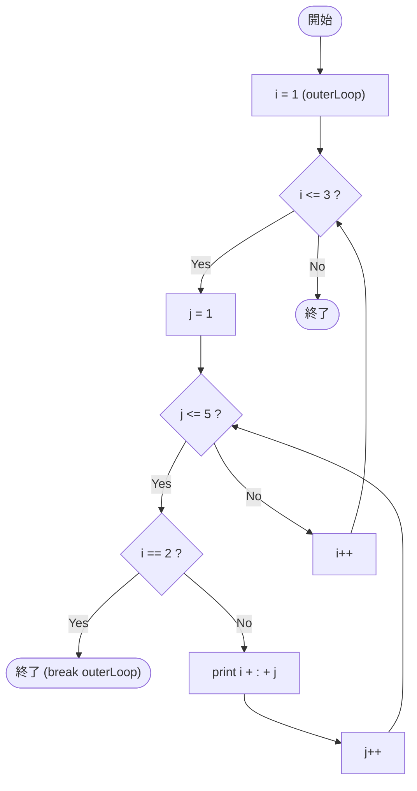

# SampleLabel01 — フローチャートとトレース表

- 対象ファイル: `src/vol06_02/SampleLabel01.java`
- パッケージ: `vol06_02`
- テーマ: ラベル付き `break outerLoop;` で外側ループまで抜ける。

## ソースの要点

```java
outerLoop: for (int i = 1; i <= 3; i++) {
    for (int j = 1; j <= 5; j++) {
        if (i == 2) {
            break outerLoop;     // 外側まで抜ける
        }
        System.out.println(i + ":" + j);
    }
}
```

## フローチャート



## トレース表

| ステップ | 外側 i | 内側 j | i==2 | 出力 | コメント |
|----|----|----|----|----|----|
| 1 | 1 | 1 | false | `1:1` | |
| 2 | 1 | 2 | false | `1:2` | |
| 3 | 1 | 3 | false | `1:3` | |
| 4 | 1 | 4 | false | `1:4` | |
| 5 | 1 | 5 | false | `1:5` | |
| 6 | 1 | 6 | - | （なし） | 内側 false → i++ |
| 7 | 2 | 1 | true | （なし） | **label で外側ループも抜ける** |

## 実行結果（標準出力）

```
1:1
1:2
1:3
1:4
1:5
```

## 学習ポイント

- `outerLoop:` のようにループの前にラベルを付けると、`break outerLoop;` で外側まで一気に抜けられる。
- 通常の `break` だけだと内側ループしか抜けないので、二重ループを完全脱出するのに使う。
- ラベル名は任意の識別子で良いが、`outerLoop` や `LOOP` のように分かりやすい名前にする。
