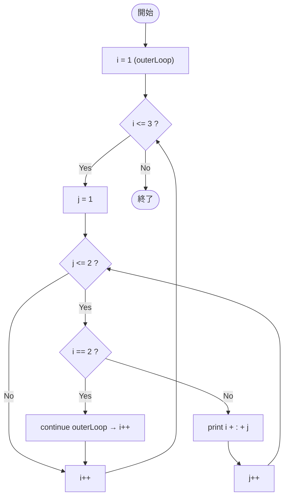

# SampleLabel03 — フローチャートとトレース表

- 対象ファイル: `src/vol06_02/SampleLabel03.java`
- パッケージ: `vol06_02`
- テーマ: ラベル付き `continue outerLoop;` で外側ループの次の反復へ進む。

## ソースの要点

```java
outerLoop: for (int i = 1; i <= 3; i++) {
    for (int j = 1; j <= 2; j++) {
        if (i == 2) {
            continue outerLoop;   // 外側の次の i へ
        }
        System.out.println(i + ":" + j);
    }
}
```

## フローチャート



## トレース表

| ステップ | 外側 i | 内側 j | i==2 | 出力 | コメント |
|----|----|----|----|----|----|
| 1 | 1 | 1 | false | `1:1` | |
| 2 | 1 | 2 | false | `1:2` | |
| 3 | 1 | 3 | - | （なし） | 内側 false → i++ |
| 4 | 2 | 1 | true | （なし） | **label で外側の次の i へ** |
| 5 | 3 | 1 | false | `3:1` | |
| 6 | 3 | 2 | false | `3:2` | |
| 7 | 3 | 3 | - | （なし） | 内側 false → i++ |
| 8 | i=4 | - | - | （なし） | 外側 false で終了 |

## 実行結果（標準出力）

```
1:1
1:2
3:1
3:2
```

## 学習ポイント

- `continue outerLoop;` は外側ループの次の反復へ進む（更新式 → 条件判定）。
- 内側ループは強制的に終了する点が、通常の continue との違い。
- i==2 のときは内側を全部スキップして次の i=3 に進む。
