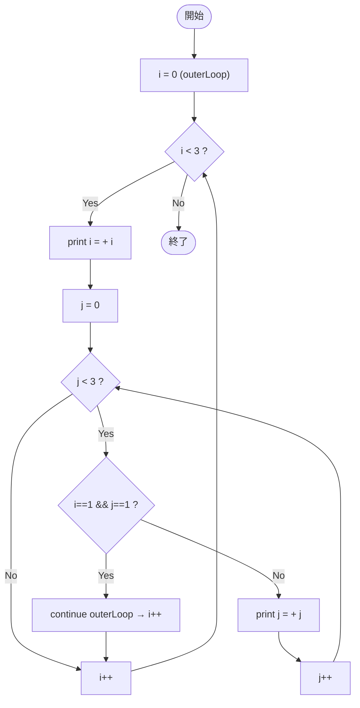

# SampleLabel04 — フローチャートとトレース表

- 対象ファイル: `src/vol06_02/SampleLabel04.java`
- パッケージ: `vol06_02`
- テーマ: ラベル付き `continue outerLoop;` （外側ループの先頭で出力するパターン）。

## ソースの要点

```java
outerLoop: for (int i = 0; i < 3; i++) {
    System.out.println("i = " + i);
    for (int j = 0; j < 3; j++) {
        if (i == 1 && j == 1) {
            continue outerLoop;
        }
        System.out.println("    j = " + j);
    }
}
```

## フローチャート



## トレース表

| ステップ | 外側 i | 内側 j | 条件 i==1 && j==1 | 出力 | コメント |
|----|----|----|----|----|----|
| 1 | 0 | - | - | `i = 0` | |
| 2 | 0 | 0 | false | `    j = 0` | |
| 3 | 0 | 1 | false | `    j = 1` | |
| 4 | 0 | 2 | false | `    j = 2` | |
| 5 | 0 | 3 | - | （なし） | 内側 false → i++ |
| 6 | 1 | - | - | `i = 1` | |
| 7 | 1 | 0 | false | `    j = 0` | |
| 8 | 1 | 1 | true | （なし） | **label で外側の次の i へ** |
| 9 | 2 | - | - | `i = 2` | |
| 10 | 2 | 0 | false | `    j = 0` | |
| 11 | 2 | 1 | false | `    j = 1` | |
| 12 | 2 | 2 | false | `    j = 2` | |
| 13 | 2 | 3 | - | （なし） | 内側 false → i++ |
| 14 | i=3 | - | - | （なし） | 外側 false で終了 |

## 実行結果（標準出力）

```
i = 0
    j = 0
    j = 1
    j = 2
i = 1
    j = 0
i = 2
    j = 0
    j = 1
    j = 2
```

## 学習ポイント

- `continue outerLoop;` は外側ループの **次の反復に進む**（外側自体を終わらせない）。
- `break outerLoop;`（SampleLabel02）と比較すると、後者は完全終了するのに対し前者は次の i に進む。
- `i = 1` のとき `j = 1` で内側を中断し、`i = 2` の反復に進んでいる点に注目。
