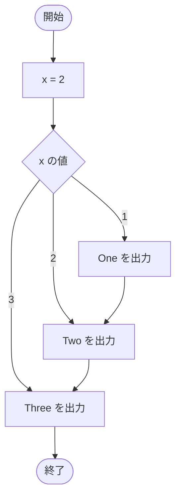

# SampleSwitch01 — フローチャートとトレース表

- 対象ファイル: `src/SampleSwitch01.java`
- パッケージ: デフォルト
- テーマ: `switch` 文の基本と、`break` がないときの fall-through を学ぶ。

## ソースの要点

```java
int x = 2;
switch (x) {
    case 1:
        System.out.println("One");
    case 2:
        System.out.println("Two");
    case 3:
        System.out.println("Three");
}
```

## フローチャート



## トレース表

| ステップ | 文 | x | マッチした case | 出力 |
|---|---|---|---|---|
| 1 | `int x = 2` | 2 | - | - |
| 2 | `switch (x)` | 2 | case 2 にジャンプ | - |
| 3 | `case 2: System.out.println("Two")` | 2 | 2 | Two |
| 4 | （break なし → fall through） | 2 | 3 | - |
| 5 | `case 3: System.out.println("Three")` | 2 | 3 | Three |

## 実行結果（標準出力）

```
Two
Three
```

## 学習ポイント

- `switch` は式の値に一致する `case` ラベルにジャンプする。
- `break` がないと、その後の case も**すべて**実行される（fall-through）。
- 通常は各 case の最後に `break` を入れる（→ `SampleSwitchBreak01`）。
