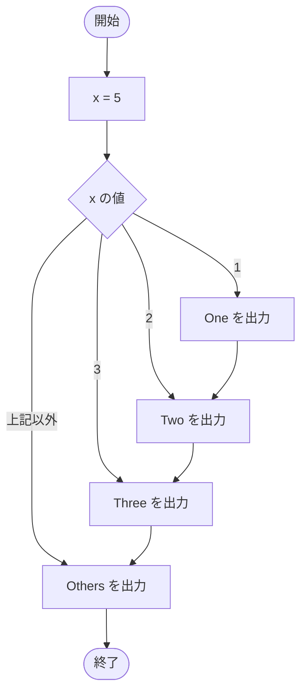

# SampleSwitch02 — フローチャートとトレース表

- 対象ファイル: `src/SampleSwitch02.java`
- パッケージ: デフォルト
- テーマ: `default` ラベルの動作。どの case にもマッチしないとき default が実行される。

## ソースの要点

```java
int x = 5;
switch (x) {
    case 1:
        System.out.println("One");
    case 2:
        System.out.println("Two");
    case 3:
        System.out.println("Three");
    default:
        System.out.println("Others");
}
```

## フローチャート



## トレース表

| ステップ | 文 | x | マッチした case | 出力 |
|---|---|---|---|---|
| 1 | `int x = 5` | 5 | - | - |
| 2 | `switch (x)` | 5 | どの case にもマッチせず default にジャンプ | - |
| 3 | `default: System.out.println("Others")` | 5 | default | Others |

## 実行結果（標準出力）

```
Others
```

## 学習ポイント

- `default` ラベルは「どの case にも一致しない場合」に実行される。
- `default` が最後にあって `break` がなくても、そのまま switch を抜ける。
- `default` は switch のどこに書いても動作するが、慣習的に末尾に置く。
