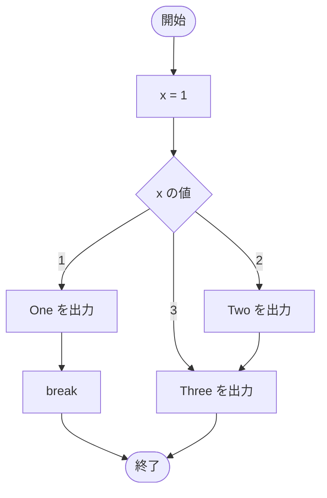

# SampleSwitchBreak01 — フローチャートとトレース表

- 対象ファイル: `src/SampleSwitchBreak01.java`
- パッケージ: デフォルト
- テーマ: `break` の役割を学ぶ。`break` があると switch をそこで抜ける。

## ソースの要点

```java
int x = 1;
// int x = 2;
// int x = 3;
switch (x) {
    case 1:
        System.out.println("One");
        break;
    case 2:
        System.out.println("Two");
    case 3:
        System.out.println("Three");
}
```

## フローチャート



## トレース表

| ステップ | 文 | x | マッチした case | 出力 |
|---|---|---|---|---|
| 1 | `int x = 1` | 1 | - | - |
| 2 | `switch (x)` | 1 | case 1 にジャンプ | - |
| 3 | `case 1: System.out.println("One")` | 1 | 1 | One |
| 4 | `break` → switch を抜ける | 1 | - | - |

## 実行結果（標準出力）

```
One
```

参考: `x=2` の場合は `Two`／`Three` の 2 行（fall-through）、`x=3` の場合は `Three` のみ。

## 学習ポイント

- `break` は switch を強制的に抜けるための命令。
- `case 1` に `break` があるので、`case 2` 以降は実行されない。
- 各 case の最後に `break` を入れるのが原則。
