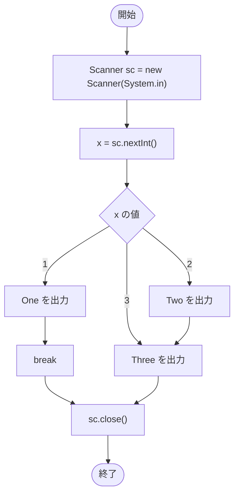

# SampleSwitchBreak01_ — フローチャートとトレース表

- 対象ファイル: `src/SampleSwitchBreak01_.java`
- パッケージ: デフォルト
- テーマ: Scanner で入力された値を switch で判定し、`break` の有無で動作がどう変わるかを確認する。

## ソースの要点

```java
Scanner sc = new Scanner(System.in);
int x = sc.nextInt(); // キーボード入力した値をxに代入.
switch (x) {
    case 1:
        System.out.println("One");
        break;
    case 2:
        System.out.println("Two");
    case 3:
        System.out.println("Three");
}
sc.close();
```

## フローチャート



## トレース表

入力例: `2`

| ステップ | 文 | x | マッチした case | 入力 | 出力 |
|---|---|---|---|---|---|
| 1 | `Scanner sc = new Scanner(System.in)` | - | - | - | - |
| 2 | `int x = sc.nextInt()` | 2 | - | 2 | - |
| 3 | `switch (x)` | 2 | case 2 にジャンプ | - | - |
| 4 | `case 2: System.out.println("Two")` | 2 | 2 | - | Two |
| 5 | (break なし → fall through) | 2 | 3 | - | - |
| 6 | `case 3: System.out.println("Three")` | 2 | 3 | - | Three |
| 7 | `sc.close()` | 2 | - | - | - |

## 実行結果（標準出力）

入力例: `2`

```
Two
Three
```

## 学習ポイント

- `case 1` には `break` があるので `One` のみで終わる。
- `case 2` には `break` がないので、`case 3` まで fall-through する。
- Scanner で動的に入力された値で switch を試せるサンプル。
