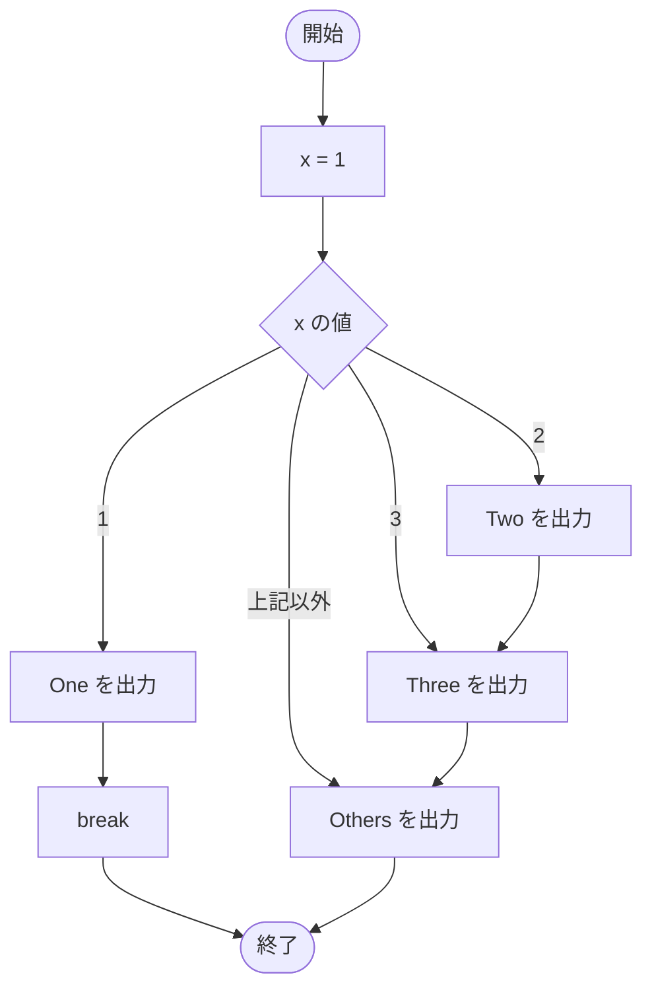

# SampleSwitchBreak02 — フローチャートとトレース表

- 対象ファイル: `src/SampleSwitchBreak02.java`
- パッケージ: デフォルト
- テーマ: `break`、`default` を組み合わせた switch の挙動確認。

## ソースの要点

```java
int x = 1;
// int x = 2;
// int x = 3;
// int x = 4;
switch (x) {
    case 1:
        System.out.println("One");
        break;
    case 2:
        System.out.println("Two");
    case 3:
        System.out.println("Three");
    default:
        System.out.println("Others");
}
```

## フローチャート



## トレース表

| ステップ | 文 | x | マッチした case | 出力 |
|---|---|---|---|---|
| 1 | `int x = 1` | 1 | - | - |
| 2 | `switch (x)` | 1 | case 1 にジャンプ | - |
| 3 | `case 1: System.out.println("One")` | 1 | 1 | One |
| 4 | `break` → switch を抜ける | 1 | - | - |

## 実行結果（標準出力）

```
One
```

参考:
- `x=2` のとき: `Two` → `Three` → `Others`
- `x=3` のとき: `Three` → `Others`
- `x=4` のとき: `Others`

## 学習ポイント

- `case 2` 以降には `break` がないため、fall-through で `default` まで進む。
- `default` を含む case も `break` がないと前の case から落ちてくる。
- 期待しない fall-through を避けるには、各 case の終わりに `break` を書く。
