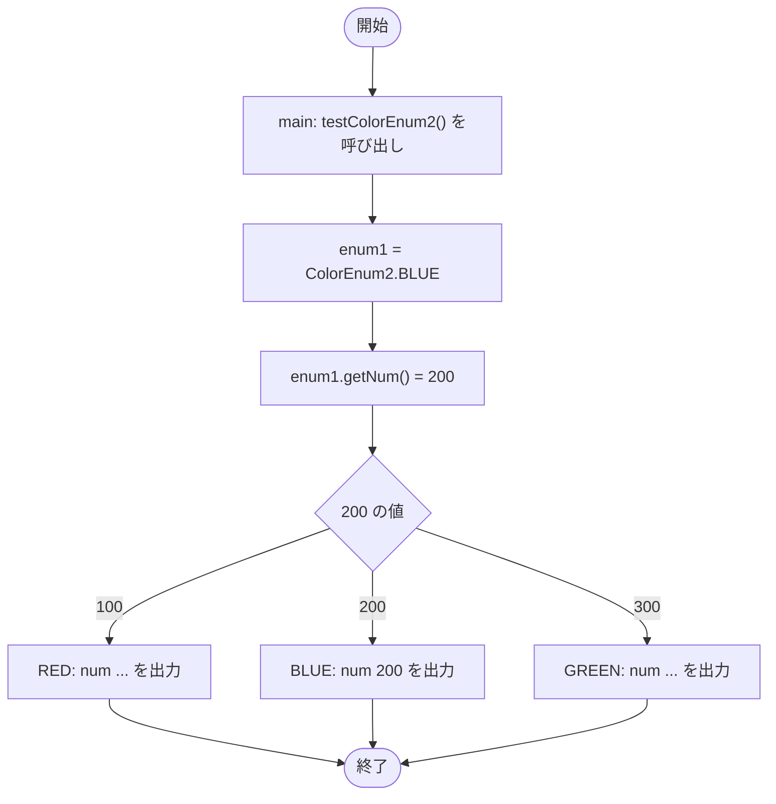

# SampleSwitchWithEnum — フローチャートとトレース表

- 対象ファイル: `src/SampleSwitchWithEnum.java`
- パッケージ: デフォルト
- テーマ: enum を switch で分岐する書き方を学ぶ。`ColorEnum`（値なし）と `ColorEnum2`（値付き）の両方を例にする。

## ソースの要点

```java
public static void main(String[] args) {
    // testColorEnum1();
    testColorEnum2();
}

private static void testColorEnum1() {
    ColorEnum enum1 = ColorEnum.RED;
    switch (enum1) {
        case RED:   System.out.println("RED"); break;
        case BLUE:  System.out.println("BLUE"); break;
        case GREEN: System.out.println("GREEN"); break;
    }
}

private static void testColorEnum2() {
    ColorEnum2 enum1 = ColorEnum2.BLUE;
    switch (enum1.getNum()) {
        case 100: System.out.println("RED: num " + enum1.getNum()); break;
        case 200: System.out.println("BLUE: num " + enum1.getNum()); break;
        case 300: System.out.println("GREEN: num " + enum1.getNum()); break;
    }
}
```

## フローチャート



## トレース表

| ステップ | 文 | enum1 | getNum() | マッチした case | 出力 |
|---|---|---|---|---|---|
| 1 | `main` → `testColorEnum2()` | - | - | - | - |
| 2 | `ColorEnum2 enum1 = ColorEnum2.BLUE` | BLUE | - | - | - |
| 3 | `switch (enum1.getNum())` | BLUE | 200 | case 200 にジャンプ | - |
| 4 | `case 200: ...` | BLUE | 200 | 200 | BLUE: num 200 |
| 5 | `break` → switch を抜ける | BLUE | 200 | - | - |

## 実行結果（標準出力）

```
BLUE: num 200
```

参考: `testColorEnum1()` を呼ぶと `RED` のみが出力される。

## 学習ポイント

- enum を switch の式に渡すと、`case RED:` のように **enum 型名を省略**して定数名だけで書ける（`testColorEnum1`）。
- 値付き enum は `getNum()` で数値を取り出して switch することもできる（`testColorEnum2`）。
- `private static` メソッドに分けることで、main から好きな方を呼び分けられる構成。
