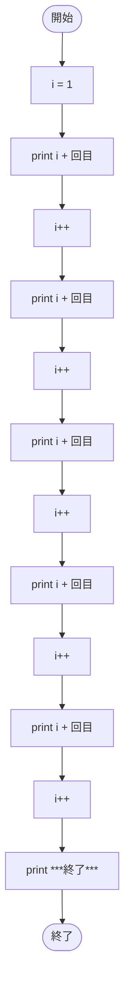

# SampleWhile01a — フローチャートとトレース表

- 対象ファイル: `src/vol06_02/SampleWhile01a.java`
- パッケージ: `vol06_02`
- テーマ: while 文を使わずに、同じ処理を逐次記述した「比較用」サンプル。

## ソースの要点

```java
int i = 1;
System.out.println(i + "回目");
i++;
// ↑ を 5 回手書きで繰り返す
System.out.println("***終了***");
```

## フローチャート



## トレース表

| ステップ | 文 | 実行前 i | 実行後 i | 出力 |
|----|----|----|----|----|
| 1 | `int i = 1;` | - | 1 | （なし） |
| 2 | `println(i + "回目")` | 1 | 1 | `1回目` |
| 3 | `i++` | 1 | 2 | （なし） |
| 4 | `println(i + "回目")` | 2 | 2 | `2回目` |
| 5 | `i++` | 2 | 3 | （なし） |
| 6 | `println(i + "回目")` | 3 | 3 | `3回目` |
| 7 | `i++` | 3 | 4 | （なし） |
| 8 | `println(i + "回目")` | 4 | 4 | `4回目` |
| 9 | `i++` | 4 | 5 | （なし） |
| 10 | `println(i + "回目")` | 5 | 5 | `5回目` |
| 11 | `i++` | 5 | 6 | （なし） |
| 12 | `println("***終了***")` | 6 | 6 | `***終了***` |

## 実行結果（標準出力）

```
1回目
2回目
3回目
4回目
5回目
***終了***
```

## 学習ポイント

- 同じ処理を 5 回書くと、修正・拡張が困難になる。
- 次の `SampleWhile01b` で while 文に書き換える比較ができる。
