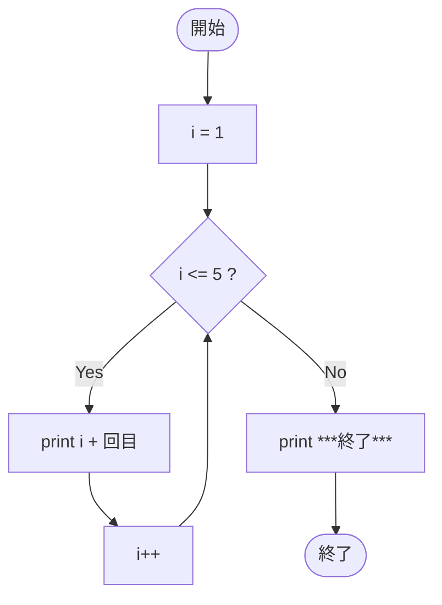

# SampleWhile01b — フローチャートとトレース表

- 対象ファイル: `src/vol06_02/SampleWhile01b.java`
- パッケージ: `vol06_02`
- テーマ: while 文を使い、同じ処理を 5 回繰り返す基本サンプル。

## ソースの要点

```java
int i = 1;
while (i <= 5) {
    System.out.println(i + "回目");
    i++;
}
System.out.println("***終了***");
```

## フローチャート



## トレース表

| ステップ | 文 | 実行前 i | 条件 i<=5 | 実行後 i | 出力 |
|----|----|----|----|----|----|
| 1 | `int i = 1;` | - | - | 1 | （なし） |
| 2 | 条件判定 | 1 | true | 1 | （なし） |
| 3 | `println(i + "回目")` | 1 | - | 1 | `1回目` |
| 4 | `i++` | 1 | - | 2 | （なし） |
| 5 | 条件判定 | 2 | true | 2 | （なし） |
| 6 | `println(i + "回目")` | 2 | - | 2 | `2回目` |
| 7 | `i++` | 2 | - | 3 | （なし） |
| 8 | 条件判定 | 3 | true | 3 | （なし） |
| 9 | `println(i + "回目")` | 3 | - | 3 | `3回目` |
| 10 | `i++` | 3 | - | 4 | （なし） |
| 11 | 条件判定 | 4 | true | 4 | （なし） |
| 12 | `println(i + "回目")` | 4 | - | 4 | `4回目` |
| 13 | `i++` | 4 | - | 5 | （なし） |
| 14 | 条件判定 | 5 | true | 5 | （なし） |
| 15 | `println(i + "回目")` | 5 | - | 5 | `5回目` |
| 16 | `i++` | 5 | - | 6 | （なし） |
| 17 | 条件判定 | 6 | false | 6 | ループを抜ける |
| 18 | `println("***終了***")` | 6 | - | 6 | `***終了***` |

## 実行結果（標準出力）

```
1回目
2回目
3回目
4回目
5回目
***終了***
```

## 学習ポイント

- while 文は「条件判定 → 本体 → 更新式 → 条件判定」の流れで繰り返す。
- 更新式 `i++` を忘れると無限ループになるので注意。
- `SampleWhile01a` と比較すると、回数の変更が容易になることが分かる。
