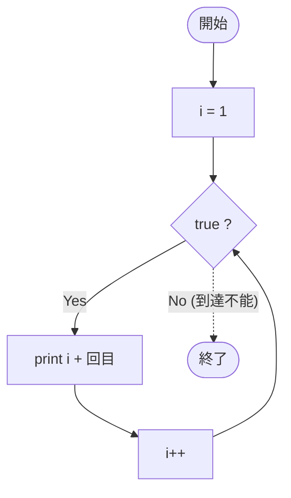

# SampleWhile02 — フローチャートとトレース表

- 対象ファイル: `src/vol06_02/SampleWhile02.java`
- パッケージ: `vol06_02`
- テーマ: `while (true)` による無限ループの例。

## ソースの要点

```java
int i = 1;
while (true) { // 無限ループ
    System.out.println(i + "回目");
    i++;
}
```

## フローチャート



## トレース表

| ステップ | 文 | 実行前 i | 条件 true | 実行後 i | 出力 |
|----|----|----|----|----|----|
| 1 | `int i = 1;` | - | - | 1 | （なし） |
| 2 | 条件判定 | 1 | true | 1 | （なし） |
| 3 | `println(i + "回目")` | 1 | - | 1 | `1回目` |
| 4 | `i++` | 1 | - | 2 | （なし） |
| 5 | 条件判定 | 2 | true | 2 | （なし） |
| 6 | `println(i + "回目")` | 2 | - | 2 | `2回目` |
| 7 | `i++` | 2 | - | 3 | （なし） |
| 8 | 条件判定 | 3 | true | 3 | （なし） |
| 9 | `println(i + "回目")` | 3 | - | 3 | `3回目` |
| 10 | `i++` | 3 | - | 4 | （なし） |
| ... | ...（永遠に継続） | ... | true | ... | `4回目`, `5回目`, ... |

## 実行結果（標準出力）

```
1回目
2回目
3回目
4回目
5回目
...（無限に続く。Ctrl+C で強制終了する必要がある）
```

## 学習ポイント

- 条件式に `true` を直接書くと無限ループになる。
- 無限ループは `break` 文や強制終了で抜ける必要がある。
- 実用では入力監視ループなどに使うが、必ず抜ける条件を入れること。
