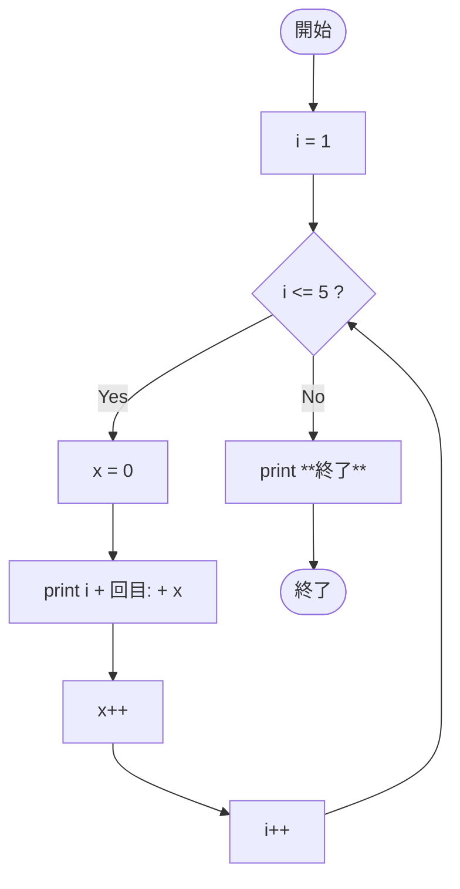

# SampleWhile03 — フローチャートとトレース表

- 対象ファイル: `src/vol06_02/SampleWhile03.java`
- パッケージ: `vol06_02`
- テーマ: while ループの内部で宣言した変数（ローカル変数 `x`）のスコープ。

## ソースの要点

```java
int i = 1;
while (i <= 5) {
    int x = 0;        // 毎回 0 に初期化される
    System.out.println(i + "回目:" + x);
    x++;              // インクリメントしてもループ終了で破棄
    i++;
}
System.out.println("**終了**");
```

## フローチャート



## トレース表

| ステップ | 文 | 実行前 i | 実行前 x | 条件 i<=5 | 実行後 i | 実行後 x | 出力 |
|----|----|----|----|----|----|----|----|
| 1 | `int i = 1;` | - | - | - | 1 | - | （なし） |
| 2 | 条件判定 | 1 | - | true | 1 | - | （なし） |
| 3 | `int x = 0;` | 1 | - | - | 1 | 0 | （なし） |
| 4 | `println(...)` | 1 | 0 | - | 1 | 0 | `1回目:0` |
| 5 | `x++` | 1 | 0 | - | 1 | 1 | （なし） |
| 6 | `i++` | 1 | 1 | - | 2 | 1 | （なし） |
| 7 | 条件判定 | 2 | - | true | 2 | - | （なし） |
| 8 | `int x = 0;` | 2 | - | - | 2 | 0 | （なし） |
| 9 | `println(...)` | 2 | 0 | - | 2 | 0 | `2回目:0` |
| 10 | `x++; i++;` | 2 | 0 | - | 3 | 1 | （なし） |
| 11 | 条件判定 | 3 | - | true | 3 | - | （なし） |
| 12 | `int x = 0;` → `println` | 3 | 0 | - | 3 | 0 | `3回目:0` |
| 13 | `x++; i++;` | 3 | 0 | - | 4 | 1 | （なし） |
| 14 | 条件判定 | 4 | - | true | 4 | - | （なし） |
| 15 | `int x = 0;` → `println` | 4 | 0 | - | 4 | 0 | `4回目:0` |
| 16 | `x++; i++;` | 4 | 0 | - | 5 | 1 | （なし） |
| 17 | 条件判定 | 5 | - | true | 5 | - | （なし） |
| 18 | `int x = 0;` → `println` | 5 | 0 | - | 5 | 0 | `5回目:0` |
| 19 | `x++; i++;` | 5 | 0 | - | 6 | 1 | （なし） |
| 20 | 条件判定 | 6 | - | false | 6 | - | ループを抜ける |
| 21 | `println("**終了**")` | 6 | - | - | 6 | - | `**終了**` |

## 実行結果（標準出力）

```
1回目:0
2回目:0
3回目:0
4回目:0
5回目:0
**終了**
```

## 学習ポイント

- `int x = 0;` がブロックの内側にあると、毎回 0 に初期化されてしまう。
- ループ内宣言の変数は、その反復の終了とともに破棄される（ブロックスコープ）。
- 累計を取りたいときは、ループの外側で変数を宣言する必要がある。
