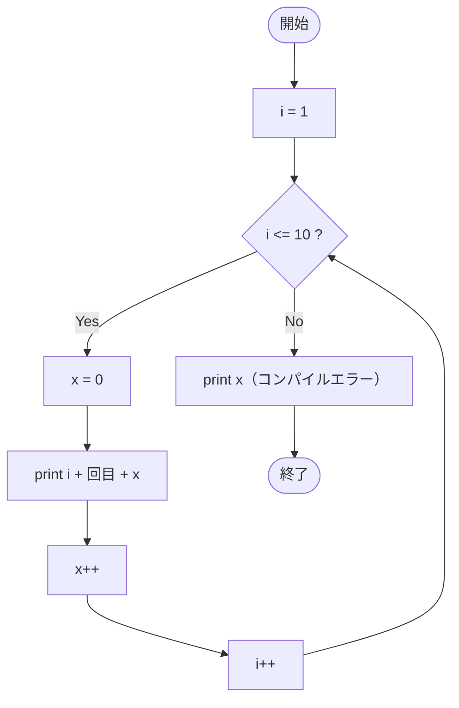

# SampleWhile04 — フローチャートとトレース表

- 対象ファイル: `src/vol06_02/SampleWhile04.java`
- パッケージ: `vol06_02`
- テーマ: ブロックスコープのコンパイルエラーを意図したサンプル（`x cannot be resolved`）。

## ソースの要点

```java
int i = 1;
while (i <= 10) {
    int x = 0;                              // while ブロック内で宣言
    System.out.println(i + "回目" + x);
    x++;
    i++;
}
System.out.println(x); // ← x cannot be resolved to a variable（コンパイルエラー）
```

## フローチャート

> コンパイルエラーがあるため実行はできない。エラーが無かったと仮定した論理フローを示す。



## トレース表

> コンパイルエラーで実行不可。仮にスコープエラーが無かった場合のトレースを示す（ループ内の `x` は毎回 0 で初期化される想定）。

| ステップ | 文 | 実行前 i | 実行前 x | 条件 i<=10 | 実行後 i | 実行後 x | 出力 |
|----|----|----|----|----|----|----|----|
| 1 | `int i = 1;` | - | - | - | 1 | - | （なし） |
| 2 | 条件判定 | 1 | - | true | 1 | - | （なし） |
| 3 | `int x = 0; println; x++; i++;` | 1 | - | - | 2 | 1 | `1回目0` |
| 4 | 条件判定 | 2 | - | true | 2 | - | （なし） |
| 5 | `int x = 0; println; x++; i++;` | 2 | - | - | 3 | 1 | `2回目0` |
| 6 | 条件判定 | 3 | - | true | 3 | - | （なし） |
| 7 | `int x = 0; println; x++; i++;` | 3 | - | - | 4 | 1 | `3回目0` |
| ... | ...（i=4〜9 まで同様） | ... | - | true | ... | 1 | `4回目0` 〜 `9回目0` |
| n | `int x = 0; println; x++; i++;` | 10 | - | true | 11 | 1 | `10回目0` |
| n+1 | 条件判定 | 11 | - | false | 11 | - | ループを抜ける |
| n+2 | `println(x)` | 11 | - | - | 11 | - | （実際にはコンパイルエラー） |

## 実行結果（標準出力）

```
（コンパイルエラーのため実行不可）
SampleWhile04.java:12: error: cannot find symbol
        System.out.println(x); // x cannot be resolved to a variable
                           ^
  symbol:   variable x
```

## 学習ポイント

- このサンプルは **コンパイルエラーを学ぶ目的の教材** (AGENTS.md に明記)。
- ブロック `{ ... }` 内で宣言した変数は、そのブロックの外では使えない。
- ループの外で `x` を使いたい場合は、while の前に `int x;` と宣言しておく必要がある。
