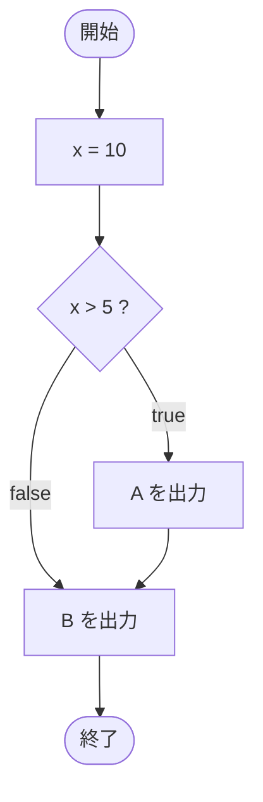

# Test0501 — フローチャートとトレース表

- 対象ファイル: `src/Test0501.java`
- パッケージ: デフォルト
- テーマ: 基本の if 文の動作確認。条件 true のときの分岐 + 後続の文の実行。

## ソースの要点

```java
int x = 10;
if (x > 5) {
    System.out.print("A");
}
System.out.print("B");
```

## フローチャート



## トレース表

| ステップ | 文 | x | 条件判定 | 出力 |
|---|---|---|---|---|
| 1 | `int x = 10` | 10 | - | - |
| 2 | `if (x > 5)` | 10 | `10 > 5` → true | - |
| 3 | `System.out.print("A")` | 10 | - | A |
| 4 | `System.out.print("B")` | 10 | - | B |

## 実行結果（標準出力）

```
AB
```

## 学習ポイント

- `print` は改行しないので、`A` と `B` が連結される。
- if のブロック外にある文は条件と無関係に常に実行される。
