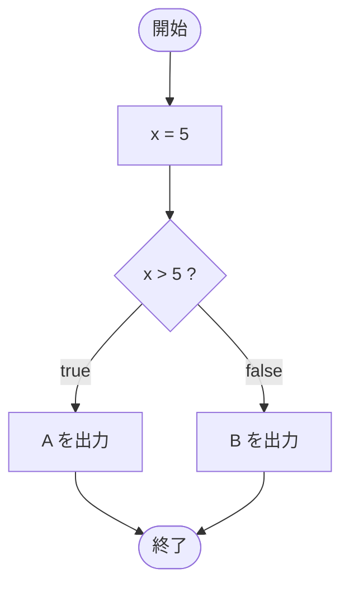

# Test0502 — フローチャートとトレース表

- 対象ファイル: `src/Test0502.java`
- パッケージ: デフォルト
- テーマ: 境界条件の確認。`x > 5` で `x == 5` のときは false になる。

## ソースの要点

```java
int x = 5;
if (x > 5) {
    System.out.print("A");
} else {
    System.out.print("B");
}
```

## フローチャート



## トレース表

| ステップ | 文 | x | 条件判定 | 出力 |
|---|---|---|---|---|
| 1 | `int x = 5` | 5 | - | - |
| 2 | `if (x > 5)` | 5 | `5 > 5` → false | - |
| 3 | `else` ブロック実行 | 5 | - | - |
| 4 | `System.out.print("B")` | 5 | - | B |

## 実行結果（標準出力）

```
B
```

## 学習ポイント

- `>` は厳密大小（等しいときは false）。`>=` と混同しないこと。
- 境界値（5 と 5）での動作を意識する。
