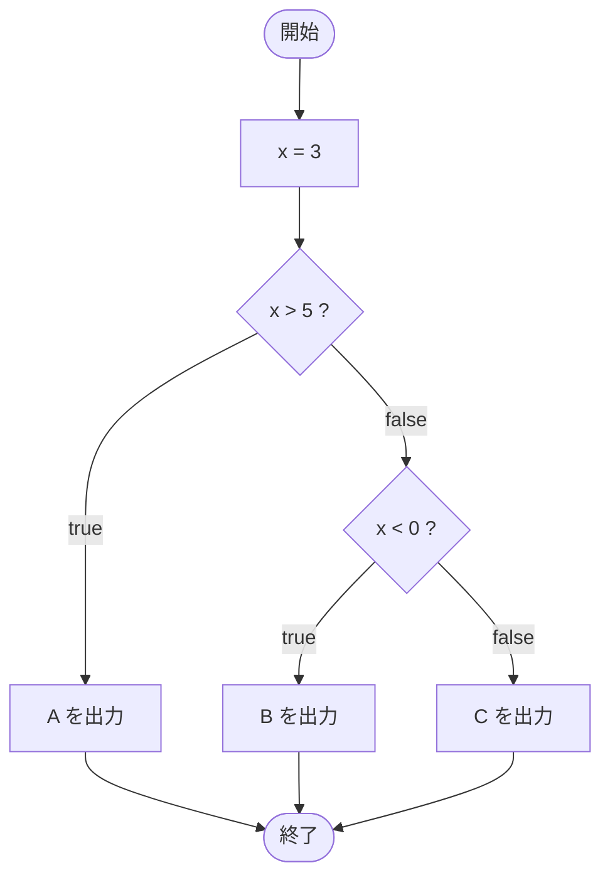

# Test0503 — フローチャートとトレース表

- 対象ファイル: `src/Test0503.java`
- パッケージ: デフォルト
- テーマ: `if-else if-else` の 3 分岐。どちらの条件にもマッチしないとき else が実行される。

## ソースの要点

```java
int x = 3;
if (x > 5) {
    System.out.print("A");
} else if (x < 0) {
    System.out.print("B");
} else {
    System.out.print("C");
}
```

## フローチャート



## トレース表

| ステップ | 文 | x | 条件判定 | 出力 |
|---|---|---|---|---|
| 1 | `int x = 3` | 3 | - | - |
| 2 | `if (x > 5)` | 3 | `3 > 5` → false | - |
| 3 | `else if (x < 0)` | 3 | `3 < 0` → false | - |
| 4 | `else` 実行 | 3 | - | - |
| 5 | `System.out.print("C")` | 3 | - | C |

## 実行結果（標準出力）

```
C
```

## 学習ポイント

- 条件は上から順に判定される。最初に true になった分岐だけが実行される。
- どの条件にも当てはまらないときは `else` が実行される。
