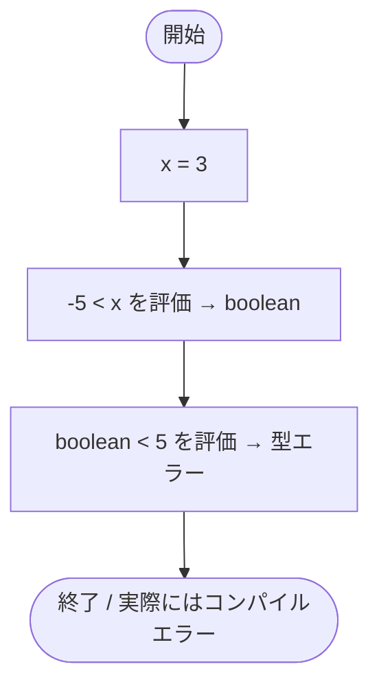
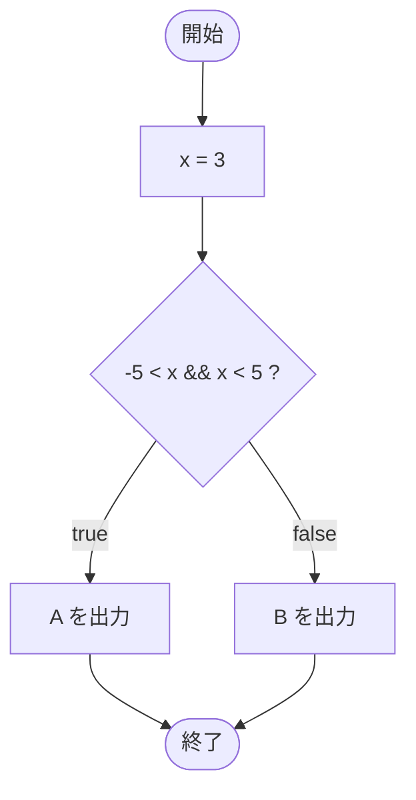

# Test0504 — フローチャートとトレース表

- 対象ファイル: `src/Test0504.java`
- パッケージ: デフォルト
- テーマ: 数学の「-5 < x < 5」のような連鎖比較は Java では書けないことを学ぶ。

## ソースの要点

```java
int x = 3;
// The operator < is undefined for the argument type(s) boolean, int
if (-5 < x < 5) {
    System.out.println("A");
} else {
    System.out.println("B");
}
```

## フローチャート（コンパイル成功した想定の論理フロー）



正しく書く場合の論理フロー:



## トレース表（修正後の正しい書き方で）

| ステップ | 文 | x | 条件判定 | 出力 |
|---|---|---|---|---|
| 1 | `int x = 3` | 3 | - | - |
| 2 | `if (-5 < x && x < 5)` | 3 | `-5 < 3 && 3 < 5` → true && true → true | - |
| 3 | `System.out.println("A")` | 3 | - | A |

## 実行結果（標準出力）

このコードはコンパイルエラーになる:

```
The operator < is undefined for the argument type(s) boolean, int
```

修正後（`-5 < x && x < 5` に直したとき）:

```
A
```

## 学習ポイント

- このファイルは**コンパイルエラーを含む**学習用サンプル。
- Java では `<` の結果が `boolean` のため、それと数値を比較する `-5 < x < 5` は型エラーになる。
- 数学のような連鎖比較は使えない。`-5 < x && x < 5` のように `&&` で連結する。
